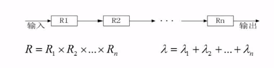

# 计算机组成与体系结构

- 数据的表示
- 计算机结构
- Flynn分类法
- CISC与RISC
- 流水线
- 层次化存储结构
- 总线
- 系统可靠性
- 校验码

## 数据的表示

* ### R进制转十进制


* ### 十进制转R进制


* ### 码制


- 原码
  <br>最高位为符号位（正0负1），其余位为绝对值，区分+0和-0

- 反码
  <br>最高位为符号位（正0负1），其余位为绝对值取反（原码除符号位外取反），区分+0和-0

- 补码
  <br>最高位为符号位（正0负1），反码基础上加1，不区分+0和-0

- 移码
  <br>在偏移2<sup>n-1</sup>的情况下，补码符号位取反即为移码

- 数值表示范围


* ### 浮点数运算

  对大阶--->尾数计算--->结果格式化（小数点前只能有一位数字）


## 计算机结构


## Flynn分类法
```
S:单
M:多
I:指令流
D:数据流
MISD:多指令流单数据流不切实际
```


## CISC与RISC

CISC时间较早,用于定制化计算机（如天气预报计算机）数量较多,使用频率差别大,可变长格式,生产周期长,寻址种类多
<br>RISC可视为当代计算机,大部分操作针对寄存器操作,只有Load/Store操作内存, 数量较少（计算机通用）,使用频率差别小,定长格式,流水线生产,寻址种类少


## 流水线

  流水线是指在程序执行时`多条指令重叠操作`的一种`准并行处理`实现技术。各个部件同时处理是针对不用指令而言的,它们可同时为多条指令的不同部分进行工作，以`提高各部件的利用率`和`指令的平均执行速度`。


* ### 流水线计算

- `流水线周期`为执行时间最长的一段

- `流水线执行时间`计算

  `例题`：若指令流水线把一条指令分为取指、分析和执行三部分，且三部分的时间分别是t取指=2ns ，t分析=2ns，t执行=1ns。则100条指令全部执行完毕需多少时间?
  <br>
  `计算公式`：1条指令执行时间 + （指令条数 - 1）* 流水线周期

  1. 理论公式计算 (80%，优先使用)
  > (t1 + t2 + ... + tk) + (n - 1) * ▲t，
  即：(2+2+1) + (100-1) * 2 = 5 + 198 = 203

  2. 实践公式计算 (20%)
  > (k + n - 1) * ▲t，其中k为一条指令分成的段数，
  即：(3 + 100 - 1) * 2 = 102 * 2 =204


- `流水线吞吐率`计算


- `流水线加速比`计算


- `流水线的效率`

  > 阴影面积 / 总面积 = `流水线的效率`


## 层次化存储结构


* ### Cache概念

  CPU向cache查找想要访问的数据中,当存在称为命中；当不存在则称为未命中，改为从主存中调取数据，并存放入Cache中


* ### 局部性原理

  `局部性原理`是指计算机在执行某个程序时，倾向于使用最近使用的数据。局部性原理有两种表现形式：时间局部性和空间局部性。

  `时间局部性`是指被引用过的存储器位置很可能会被再次引用，例如：重复的引用一个变量时则表现出较好的时间局部性

  `空间局部性`是指被引用过的存储器位置附近的数据很可能将被引用；例如：遍历二维数组时按行序访问数据元素具有较好的空间局部性

* ### 主存分类


* ### 主存编址

  `例题`：内存地址从AC000H到C7FFFH，共有（1）K个地址单元，如果该内存地址按字（16bit）编址，由28片存储器芯片构成。已知构成此内存的芯片每片有16K个存储单元，则该芯片每个存储单元存储（2）位。
  
  `解答`：<br>
  1.C7FFFH - AC000H + 1 -> C8000H - AC000H = 1C000H -> 1C000H / 2<sup>10</sup> = 1 * 16<sup>4</sup> + 12 * 16<sup>3</sup> / 2<sup>10</sup> = 1 * 2<sup>16</sup> + 12 * 2<sup>12</sup> / 2<sup>10</sup> = 2<sup>6</sup> + 12 * 2<sup>2</sup> = 112K个地址单元<br>
  2.(112K * 16bit) / (28 * 16K * X) = 1 -> X = (112K * 16bit) / (28 * 16K) = 4bit


* ### 磁盘结构与参数


`存取时间` = 寻道时间（平均定位时间） + 等待时间（转动延时）

`例题`（较难）：<br>


`解答`：<br>
 1. `最长时间` = 处理R0需要的时间（首次直接访问） + 处理其他块需要的时间（需要转动最长的时间） -> 6 + (30 + 6) * 10 = 366ms


 2. `最少时间`：没有时间浪费，不需要转动-> 6 * 11 = 66ms


## 总线（选择题，基本概念）

  `总线`：内部总线，系统总线，外部总线<br>
  `系统总线`：数据总线，地址总线，控制总线

## 系统可靠性

* ### `串联系统`

  R代表可靠率，串联系统可靠性通过相乘得到结果，即：系统可靠率R = 子系统1的可靠率R1 * 子系统2的可靠率R2 * ... * 子系统n的可靠率Rn



* ### `并联系统`

  R代表可靠率，并联系统可靠性通过计算1 - 子系统同时失效的概率得到。因为该系统只要有一条路能通便可用，只有全部不通，系统才失效。即：系统可靠率R = 1 - （子系统1的失效率（1-R1） * (子系统2的失效率（1-R2） * ... * (子系统n的失效率（1-Rn））


`例题`

下图中总体为串联系统，局部并联系统


## 差错控制（基本必考）

* ### `码距`：整个编码系统中任意两个码字的最小距离

* ### 检错和纠错
  在一个码组内为了检测e个误码，最小码距d应满足d >= e + 1，例：2位长度的二进制编码（a=11，b=00，传10）<br>
  在一个码组内为了纠正t个误码，最小码距d应满足d >= 2t + 1，例：3位长度的二进制编码（a=111，b=000，传110，纠正为111）

* ### 循环校验码CRC（可以检错不能纠错）

  参考：[CRC校验原理及步骤](https://blog.csdn.net/d_leo/article/details/73572373)

  `CRC校验码计算例题`：<br>
  原始报文为“10110011”，其生成多项式为“X<sup>4</sup> + X<sup>3</sup> + 1”。对其进行CRC编码后的结果为？
  
  `具体计算过程`：<br>
  1、将生成多项式转化为二进制序列：X<sup>4</sup> + X<sup>3</sup> + 1 -> 11001<br>
  2、多项式的位数为5，则在数据帧的后面加上5-1位0（余数的位数），数据帧变为101100110000，然后使用模2除法除以除数11001，得到余数。<br>
  3、将计算出来的4位余数替换第2步中添加的5-1位0，得到CRC编码后的结果101100110100。

  `检错`：<br>
  发送端将CRC编码后的数据帧发送给接收端，接收端收到数据帧后，用上面选定的生成多项式，做模2除法运算，验证余数是否为0，如果为0，则说明数据帧没有出错。


* ### 海明校验码

  参考：[海明校验码](https://blog.csdn.net/louyxlovess/article/details/62037900)

  海明校验法中，校验码存放在2<sup>n</sup>位置，存在公式2<sup>r</sup> ≥ k + r + 1，则能正确生成海明校验码。其中r为校验位个数，k为信息位个数，信息位个数是已知的。

  `海明校验码计算例题`：<br>
  求信息1011的海明码<br>
  `具体计算过程`：<br>
  1、首先确定信息位个数k为4，那么随之校验位的个数r也就知道了是3，画表格；<br>
  2、根据信息位的位置列出校验位公式；<br>
  3、根据公式得到校验位的值；<br>
  4、将数据加入表格得到的结果就是信息的海明码。

  `检错及纠错`：<br>
  将收到的校验位和第3步中产生的校验位做异或运算，运算的结果如果为全0，则说明数据帧没有出错，否则结果对应的10进制值为出错的位置。

