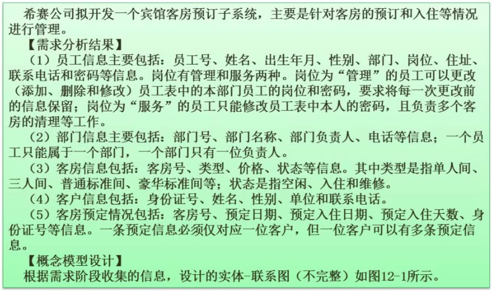

# 数据库设计（下午）

- 数据库设计过程
- ER模型
- 答题技巧

## 数据库设计过程

## ER模型

### 实体间联系类型

### ER图转关系模型

## 答题技巧

- 详细分析试题说明

- 熟练掌握基本知识

`例题1`：

[BV1Eb411W7kc?p=178](https://www.bilibili.com/video/BV1Eb411W7kc?p=178)

问题1：`一条预订信息仅对应一位客户`不等于`一间客房只可以被一位客户预定（时间错开）`

（1）n

（2）m

（3）n

问题2：`员工拥有权限，按岗位划分`

问题3：`ER模型转关系模式`

（4）员工号、`部门号`（员工和权限的联系可以通过岗位维系，员工和部门的联系须通过部门维系）

（5）客房号

（6）身份证号

（7）岗位（保留更改前信息，原来的权限信息）

（8）身份证号（预订人）、客房号

问题4：`题干实际上是逆规范化的操作，考察规范化理论。`

缺点：操作权限的描述会重复村很多次，造成数据冗余

优点：减少了一次联接操作，查询速度快

`例题2`：

[BV1Eb411W7kc?p=180](https://www.bilibili.com/video/BV1Eb411W7kc?p=180)

问题1：经理是特殊的员工，`特殊化关系`

问题2：`主键`：唯一标识、`外键`：其他关系的主键

（a）商场编号（缺少商场和部门的联系）

（b）部门编号（缺少员工和部门的联系）

（c）员工编号

主键：

部门：部门编号，员工：员工编号，经理：员工编号

外键：

部门：商场编号，员工：部门编号，经理：员工编号

问题3：

（1）紧急联系人

员工和紧急联系人是n:1联系

紧急联系人（员工编号，姓名，电话）