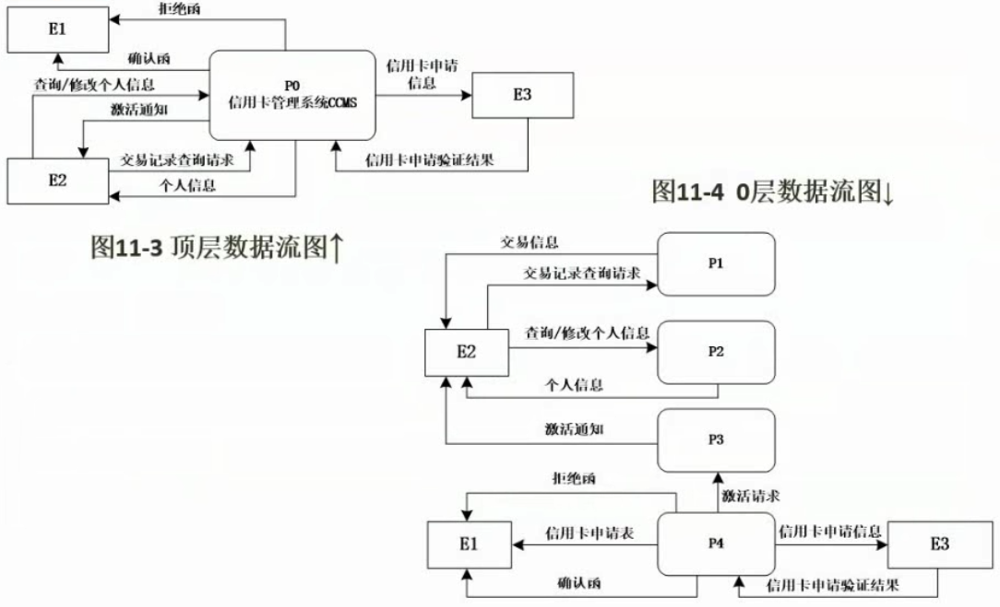

# 数据流图（必考 下午 15分）

- 数据流图基本概念
- 数据字典
- 数据平衡原则

## 数据流图基本概念

与E-R图区分开

## 分层数据流图DFD

数据流图也叫做分层数据流图

## 数据字典

## 数据流图的平衡原则

基本原则：

- 父图与子图平衡

- 子图内平衡：子图内的任意一个加工应该既有输入又有输出

0层图中缺少：中间件 ---处理后的操作结果---> 前端应用

## 答题技巧

- 详细分析试题说明：题目中每一句话都对应到图中

- 利用数据平衡原则：方向错误、数据流缺失

`例题1`：

[BV1Eb411W7kc?p=172](https://www.bilibili.com/video/BV1Eb411W7kc?p=172)

结题思路：先从问答题（与题干无关，帮助回顾概念）入手

问题4：加工本身就不合格，数据流不平衡，如黑洞或奇迹（算两种，黑洞问题、奇迹问题）；数据流命名问题，输入流和输出流一样；输入流经过加工不可能产生这样的输出流

问题1：`外部实体`找特殊数据流

问题2：`数据存储`找存储的数据是什么

问题3：`缺失数据流`利用数据平衡原则找，先找中间件外的数据流，再找中间件内的数据流

`例题2`：

[BV1Eb411W7kc?p=173](https://www.bilibili.com/video/BV1Eb411W7kc?p=173)

问题1：找外部实体

问题2：文字描述与图一一匹配

问题3：逐个分析，比较顶层图和0层图（一一匹配）

问题4：找加工，看涉及（特殊）数据流名称与题干匹配