# UML建模（下午 难度较高）

- 用例图
- 类图与对象图
- 顺序图
- 活动图
- 状态图
- 通信图（协作图）
- 构件图

## 用例图

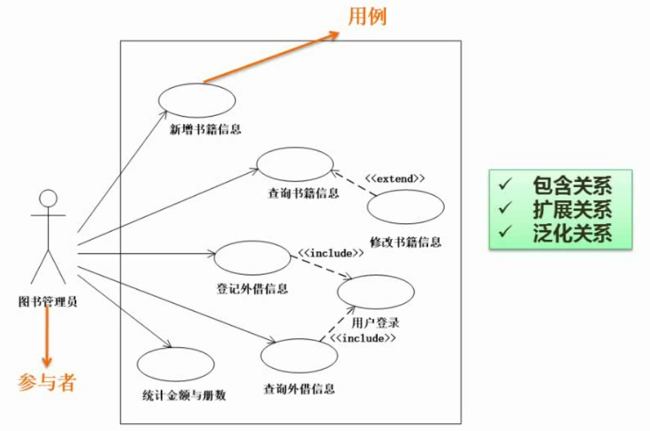

考点：

1.根据题干及已有结构分析补充用例名称、参与者角色
  
  - 参与者、用例的识别：紧扣题干，一一匹配

2.根据题干分析两个用例之间的关系

- 包含关系：include

- 扩展关系：extend

- 泛化关系

- 区分`包含`和`扩展`：看是否必须

## 类图与对象图

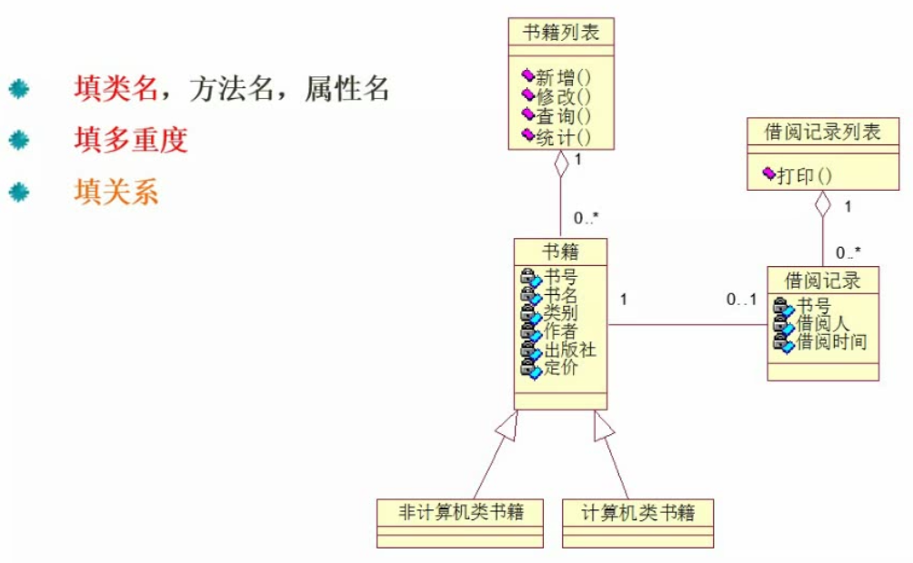

考点：

1.填类名，方法名、属性名（较少）

2.填多重度

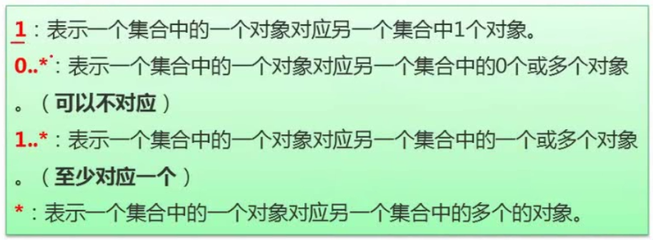

3.填关系

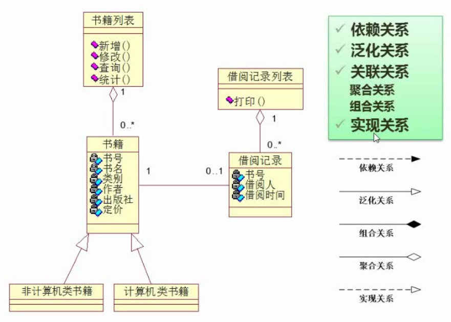

## 顺序图

从上往下执行，强调时间顺序

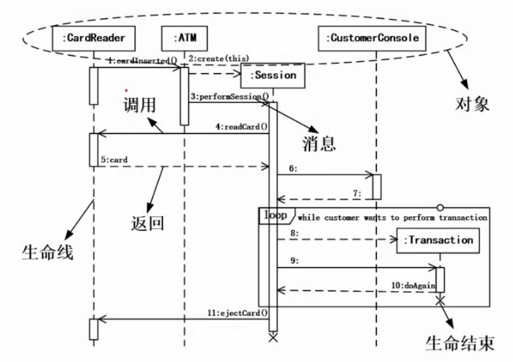

考点：

1.根据题目描述及处理流程补充消息

2.补充对象

## 活动图

粗横线之间表示并行线程

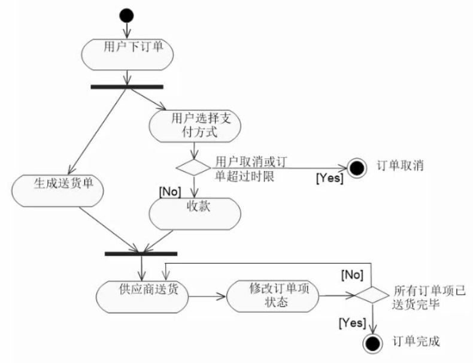

带甬道的活动图：指示不同的对象，明确活动归属于哪个对象

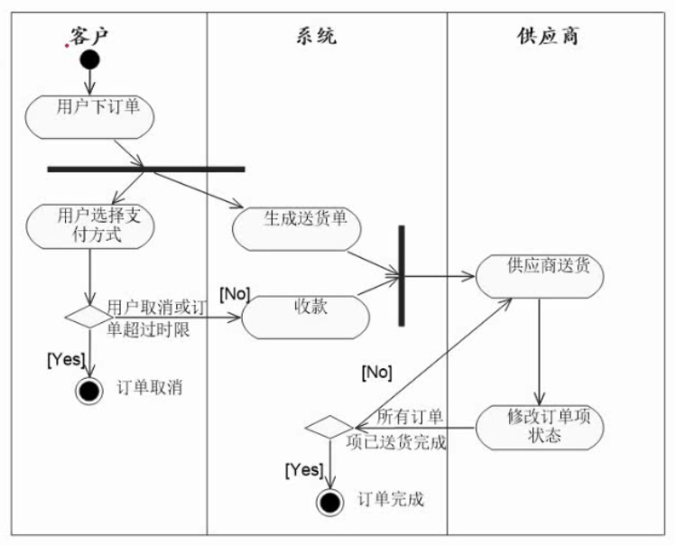

## 状态图

表现状态的变迁，也归为动态图

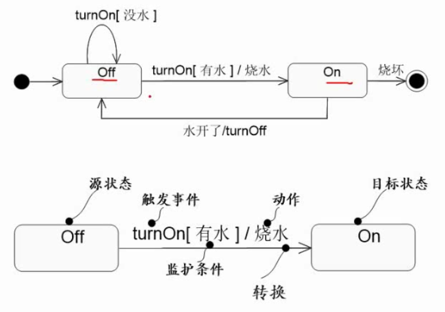

考点：补充状态及状态变迁的条件（触发事件）

- 先识别总共有哪些状态，再找条件

## 通信图（协作图）

顺序图的另一种表达方式，不强调时间；和顺序图统称为交互图

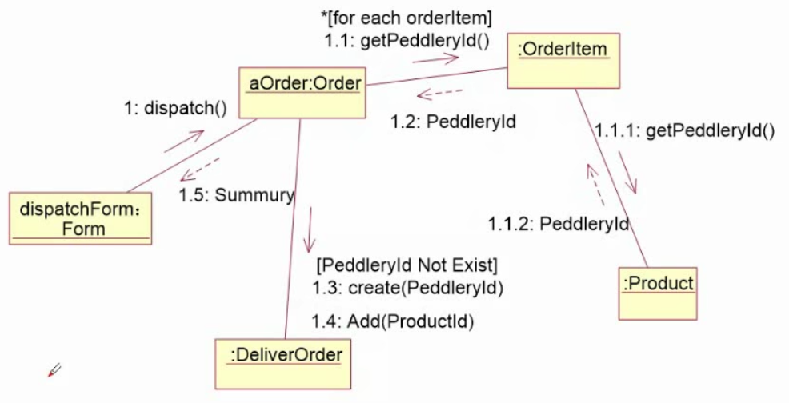

考点：补充消息(箭线上的描述)

## 案例分析

`例题`：

[BV1Eb411W7kc?p=191, 189, 190](https://www.bilibili.com/video/BV1Eb411W7kc?p=191)

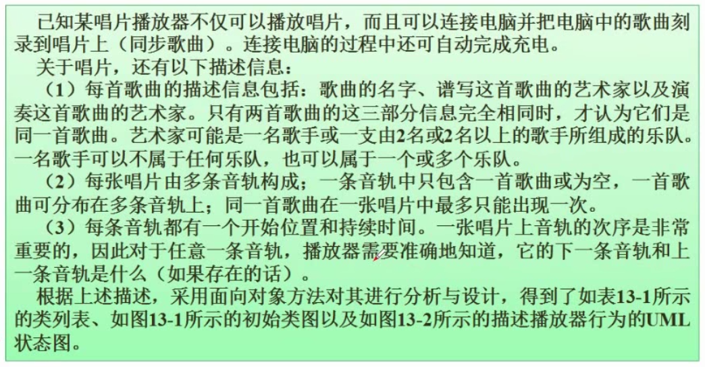
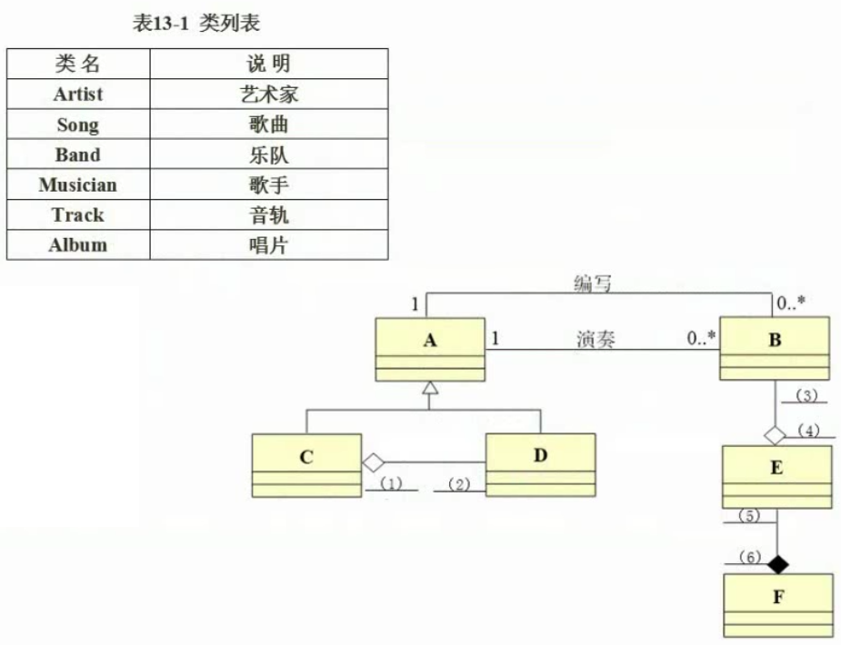
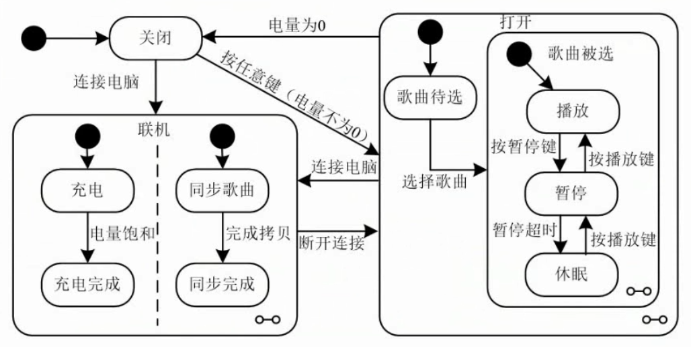
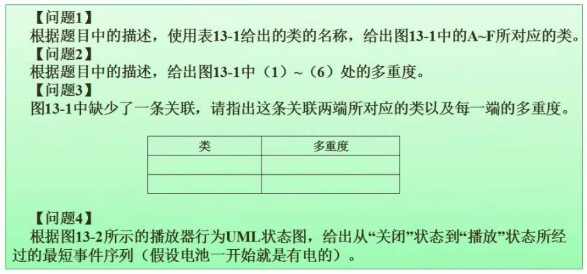

问题1：根据题干类与类之间的关系补充类图（填类名）

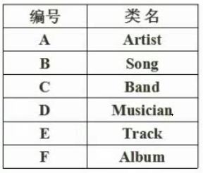

问题2：根据题干确定多重度，从两个角度考虑

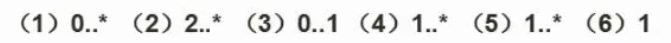

问题3：分析题干，一一匹配

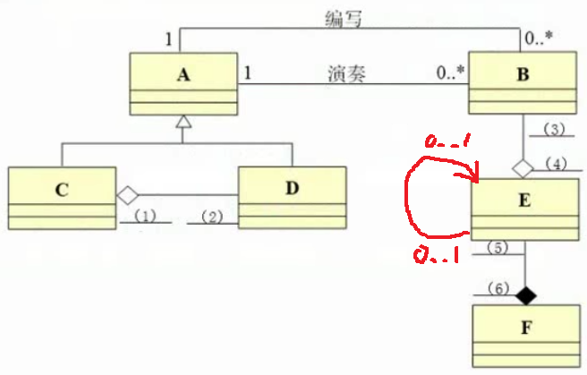

问题4：

按任意键 -> 选择歌曲（路径最短）

连接电脑 -> 电量饱和 | 完成拷贝 -> 断开连接 -> 选择歌曲