# 数据结构及算法应用（下午 难点）

- 分治法
- 回溯法
- 贪心法
- 动态规划法

## 分治法

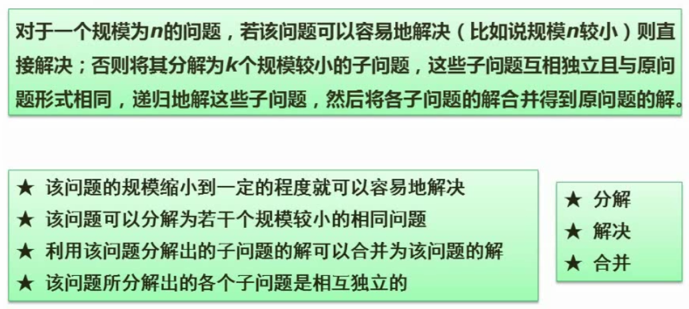

递归

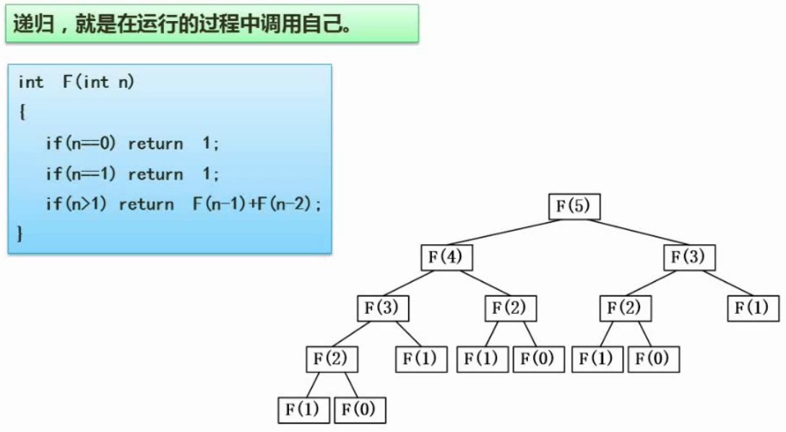

二分法查找

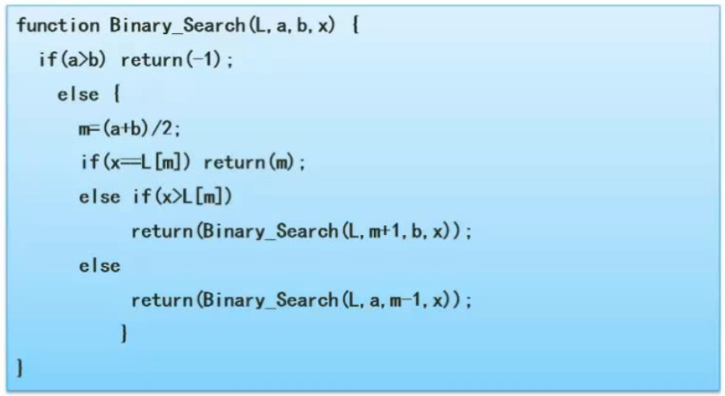

## 回溯法

迷宫问题

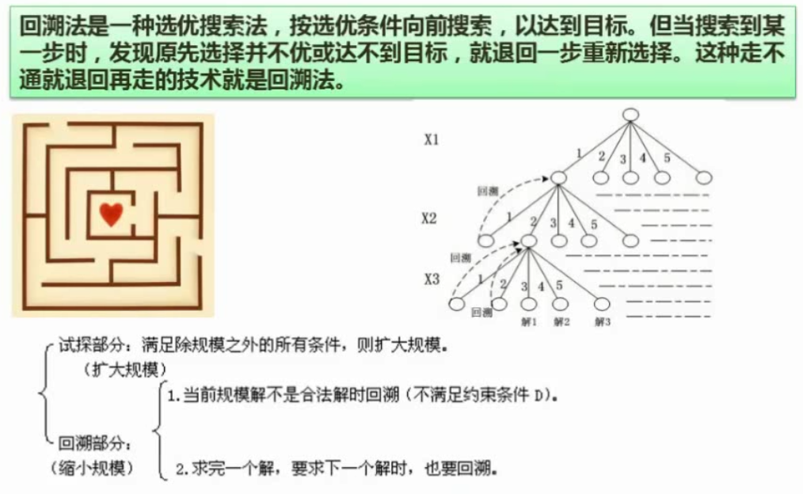

## 贪心法

不一定能得到最优解

背包问题：优先选单位价值高的

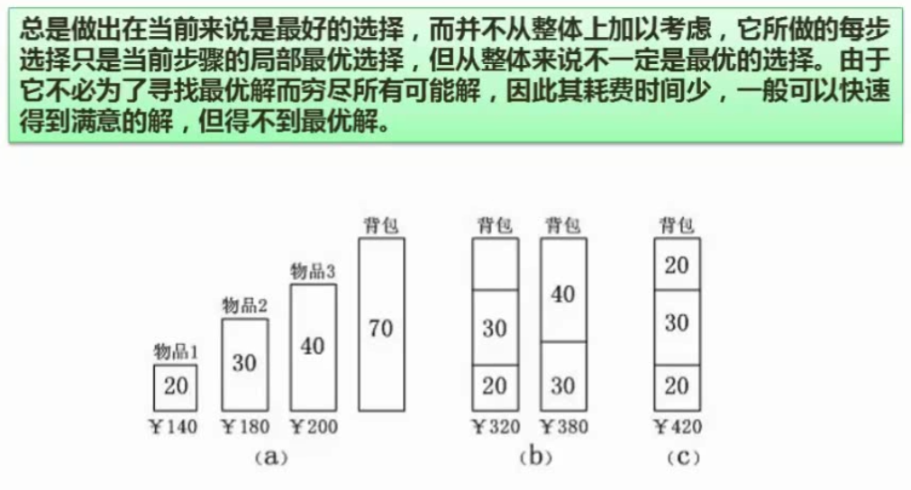

## 动态规划法

与分治法的区别：动态规划法往往需要构造一个表，查表

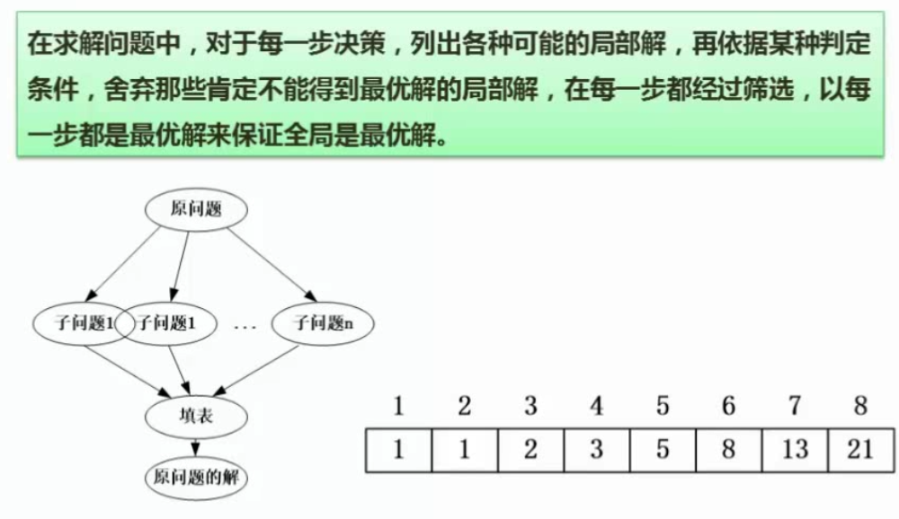

## 案例分析

`例题1`：

[BV1Eb411W7kc?p=200, 199, 210, 202](https://www.bilibili.com/video/BV1Eb411W7kc?p=200)

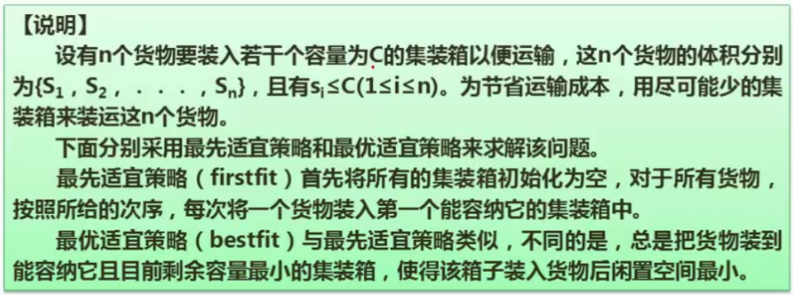
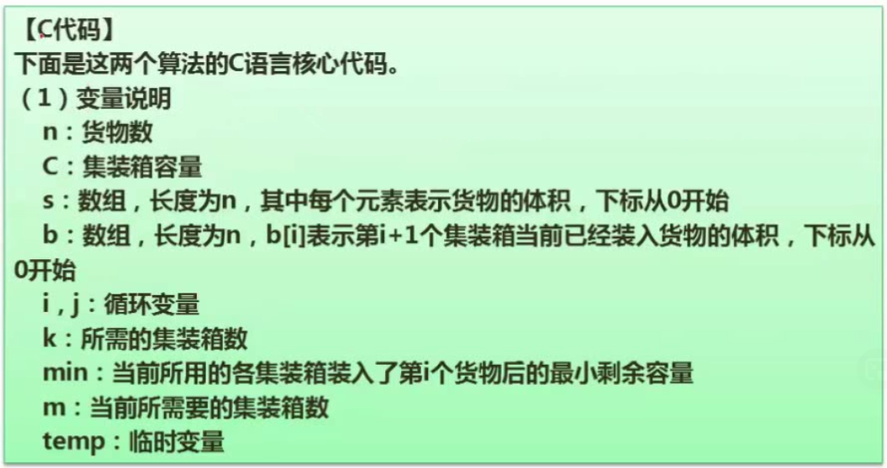
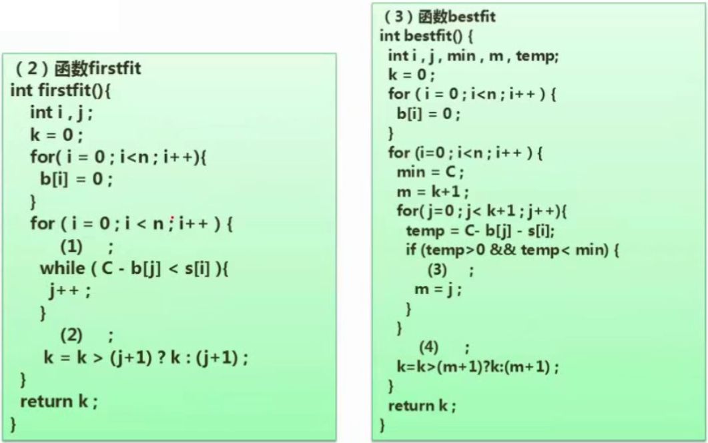
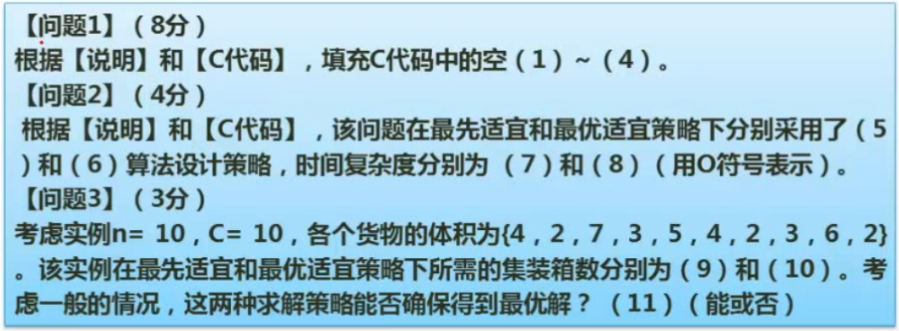

`解题思路`：先做概念题，后补充代码

问题3：最先适宜策略结果比最优适宜策略差，且最优适宜策略属于贪心法，两者都不能确保得到最优解

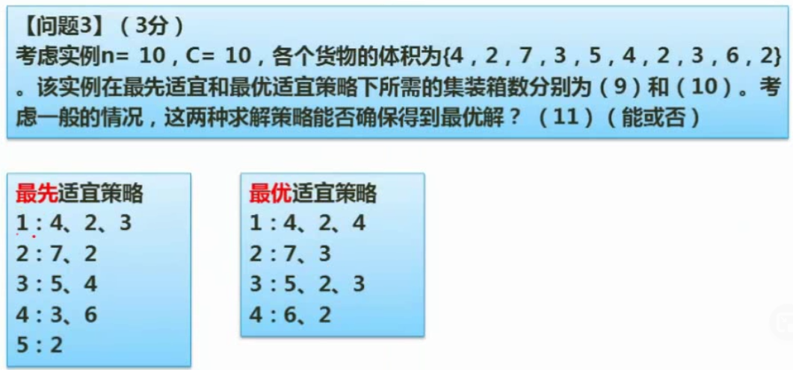

问题2：

（5）最先适宜策略：用最小的代价找到一个合适的位置 -> 贪心法

（6）最优适宜策略：每一步都选当前局部最优的方案 -> 贪心法

（7）O(n2)

（8）O(n2)

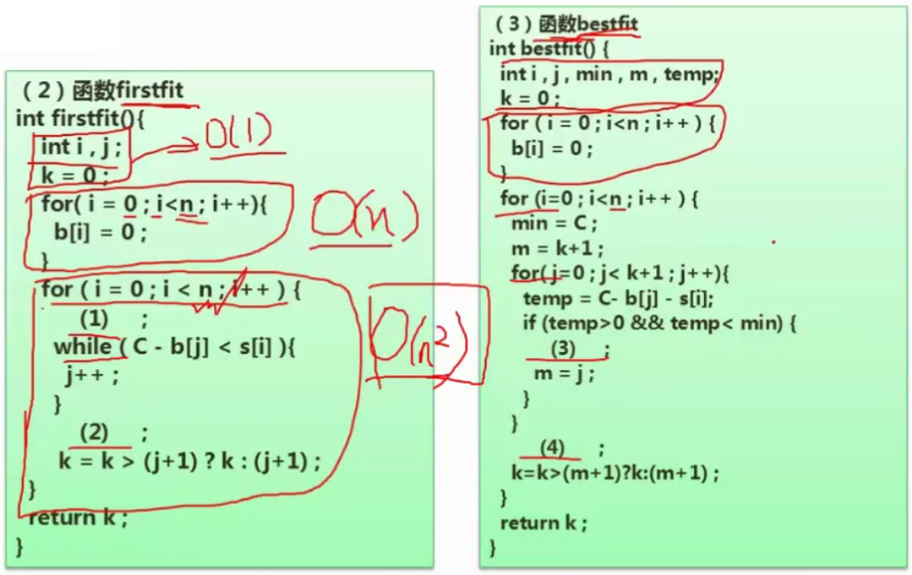

问题1：

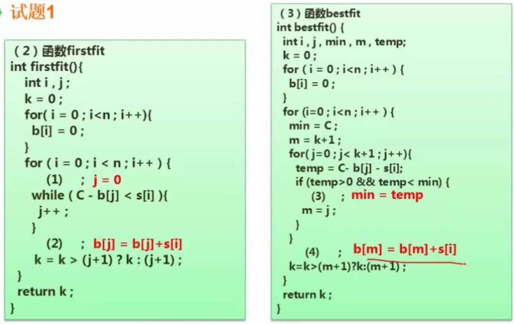

`例题2`：

[BV1Eb411W7kc?p=204](https://www.bilibili.com/video/BV1Eb411W7kc?p=204)

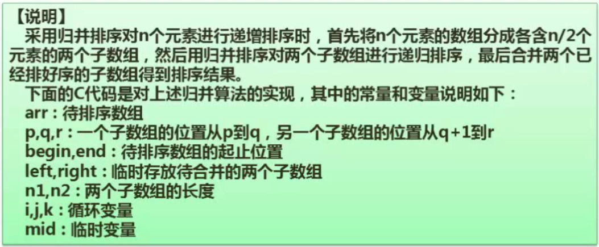
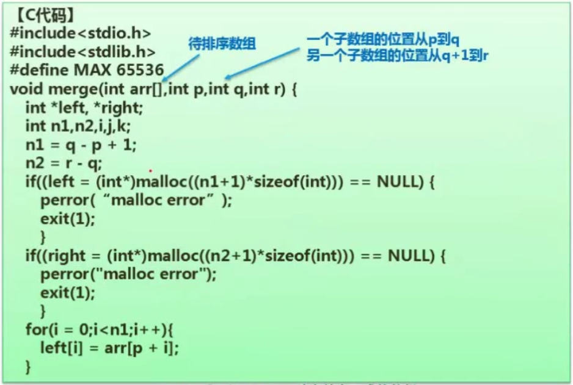
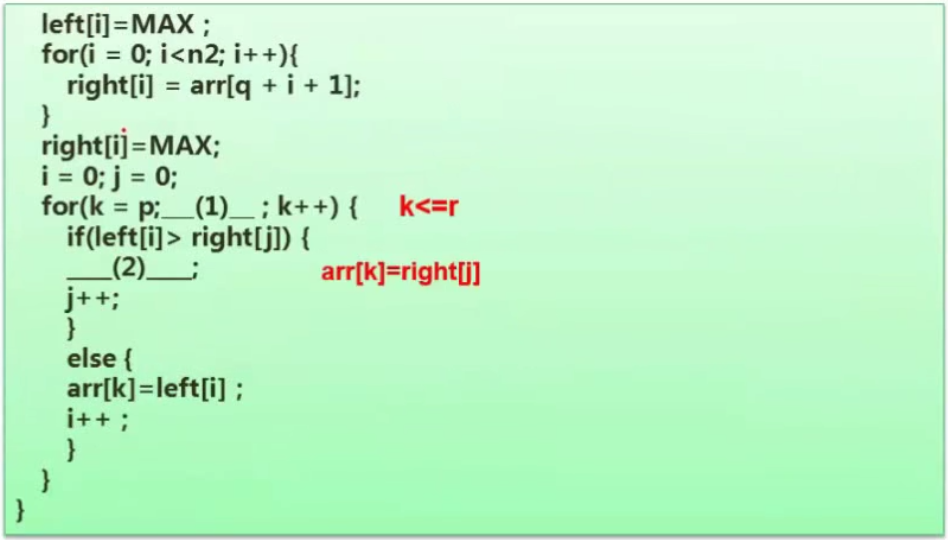
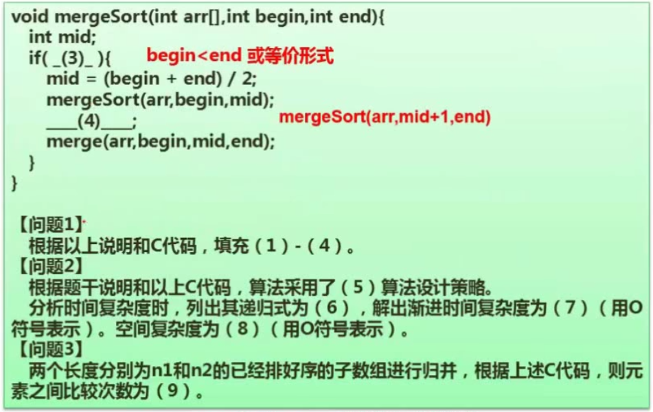

问题2：

 （5）分治法

 （6）T(n)=2T(n/2)*O(n)

 （7）单层循环 -> O(nlog2n)

 （8） 交换空间n -> O(n)

 问题3：

 （9）n1+n2