# 面向对象程序设计（下午 难点）

- C++及Java语法要点
- 设计模式程序实现

## 语法要点

### C++

* 类与派生类的定义

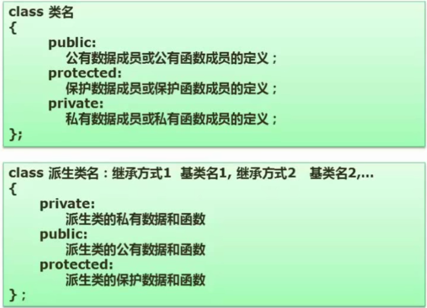

* 类外定义函数体

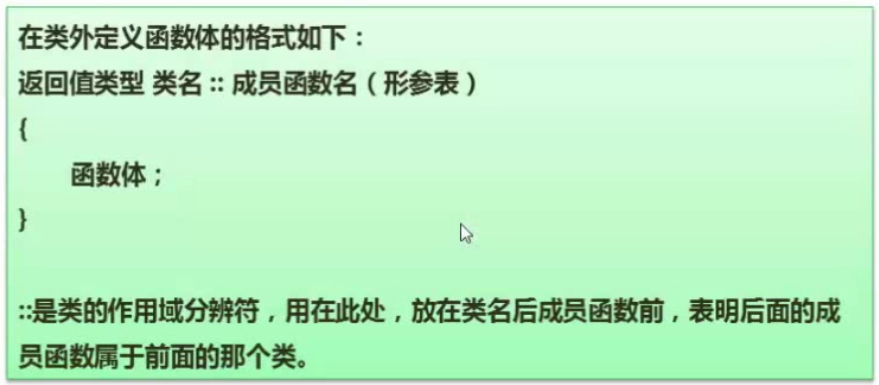

* 构造函数与析构函数

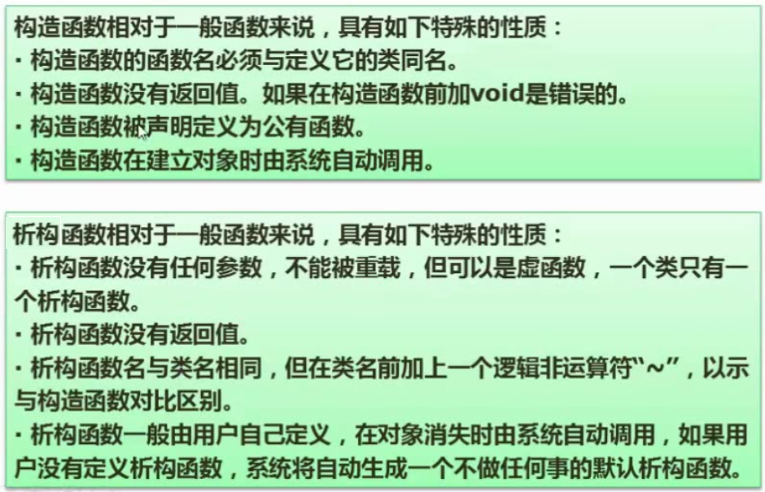

* 对象指针与对象引用


* 虚函数

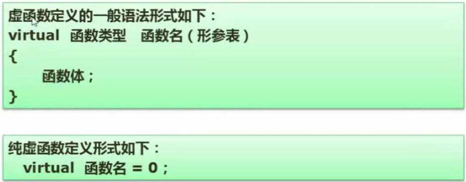

### Java

* 类的定义

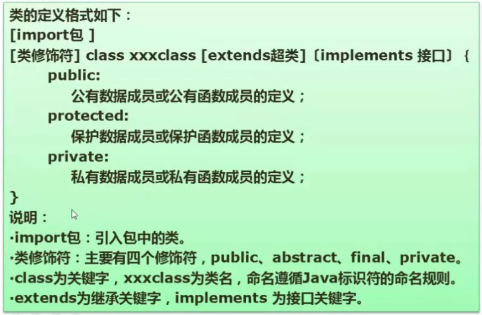

* 接口的定义


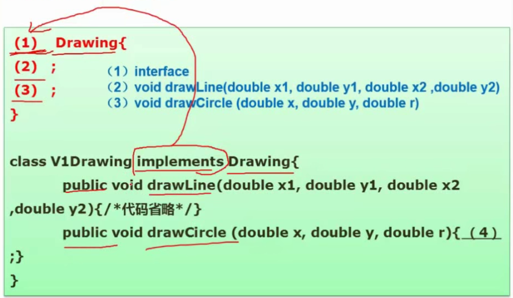

## 案例分析

`例题1`：

[BV1Eb411W7kc?p=207](https://www.bilibili.com/video/BV1Eb411W7kc?p=207)

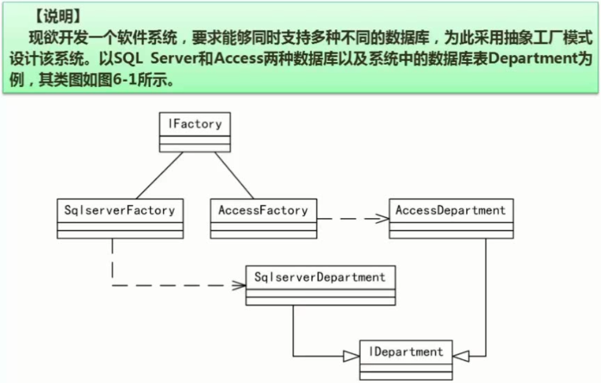
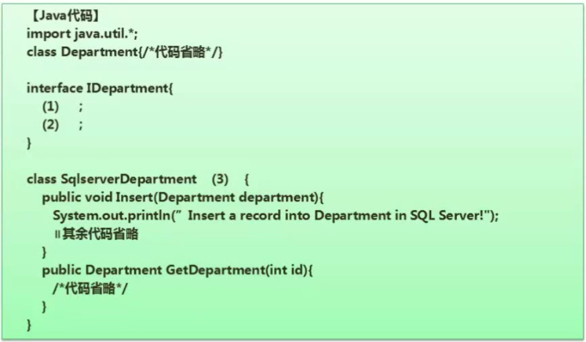
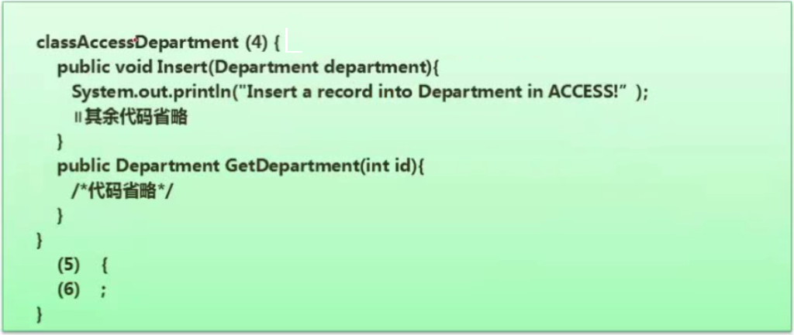
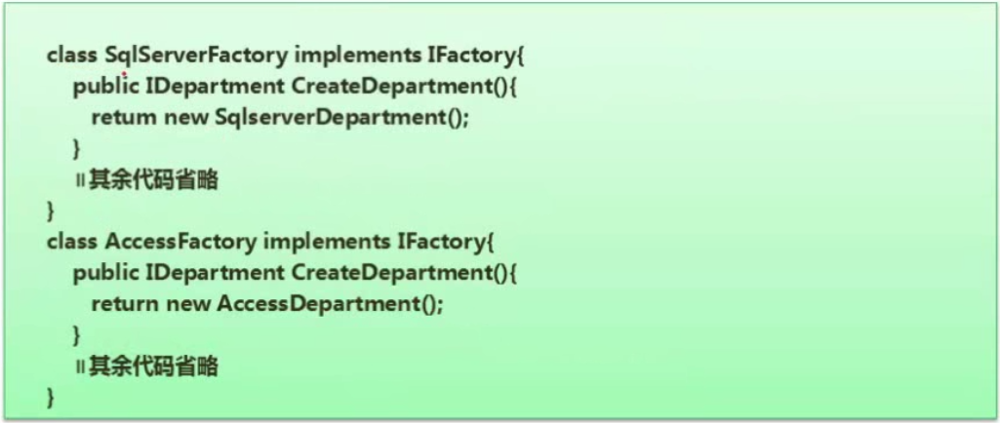

解答：

（1）
```java
void Insert(Department department)
```
（2）
```java
Department GetDepartment(int id)
```

（3）
```java
implements IDepartment
```

（4）
```java
implements IDepartment
```

（5）
```java
interface IFactory
```

（6）
```java
Idepartment CreateDepartment()
```

`例题2`：

[BV1Eb411W7kc?p=209, 208](https://www.bilibili.com/video/BV1Eb411W7kc?p=209)

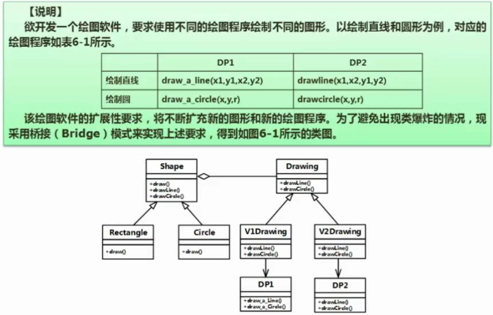
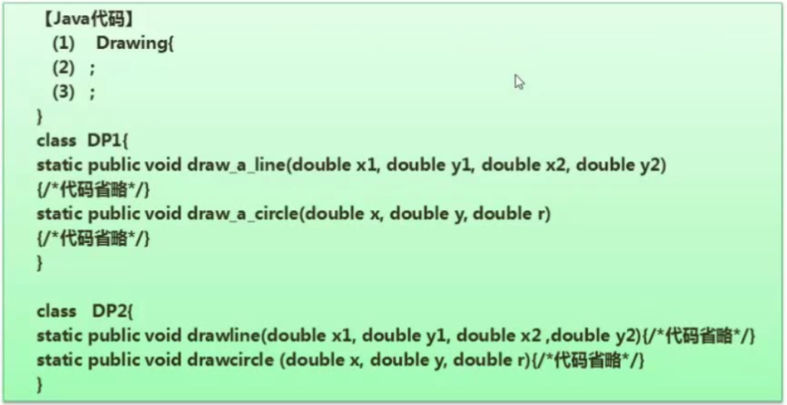
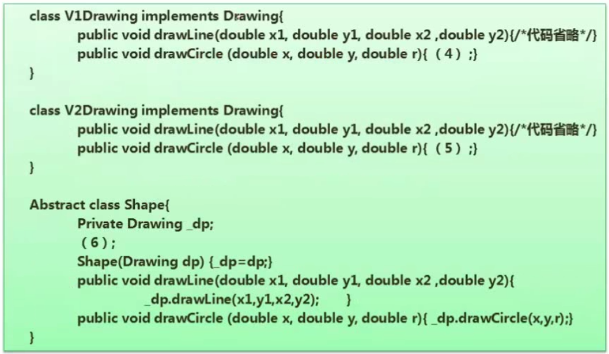
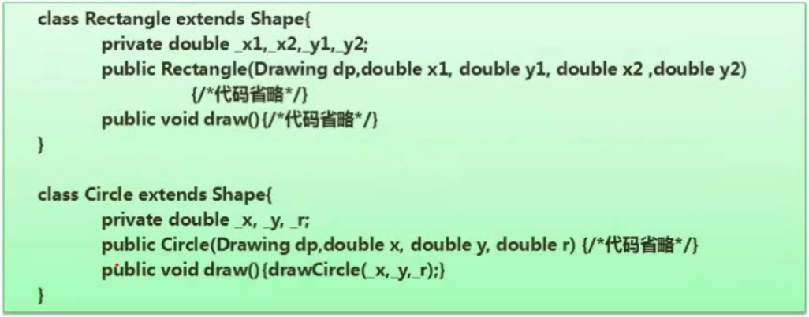

解答：

（1）接口 -> 查看前后代码如何用到该接口
```java
interface
```
（2）
```java
void drawLine(double x1, double y1, double x2, double y2)
```

（3）
```java
void drawCircle(double x, double y, double r)
```

（4）一般填写调用性代码，从UML类图中找线索
```java
DP1.draw_a_circle(x, y, r)
```

（5）
```java
DP2.draw_a_circle(x, y, r)
```

（6）抽象类 -> 查看前后代码如何用到该抽象类
```java
abstract public void draw()
```