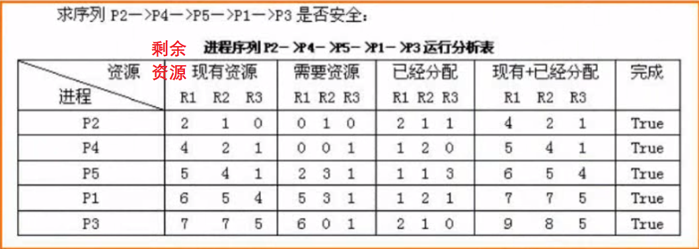
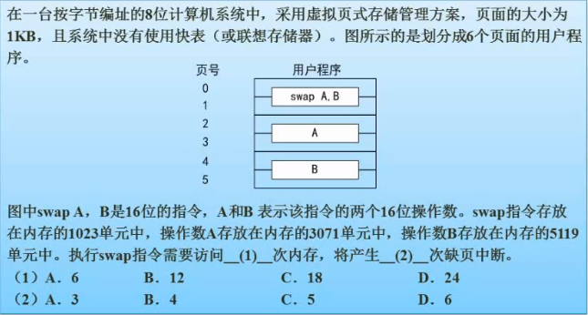

# 操作系统概述   (上午题7分)

- 进程管理
- 存储管理
- 文件管理
- 作业管理（少）
- 设备管理（少）
- 微内核操作系统

## 进程管理
- ### 进程的状态


- ### 前驱图（常考，结合PV操作）


- 进程的同步与互斥

互斥：不允许同时使用资源
同步：有速度匹配要求


- ### PV操作（难）

* 基本概念


* 例题


- ### 前趋图 -> PV操作（常考）

* 例题

     `解题技巧`：从上到下，从左到右在箭头上标信号量，箭头起点对应V操作，箭头终点对应P操作


- ### 死锁

     不会发生死锁的资源最小个数 = （每个进程需要的系统资源 - 1） * 进程数量 + 1


* 死锁的预防：打破四大条件
* 死锁的避免：有序资源分配法、银行家算法

- ### 银行家算法（常考）

`原则`


`例题`


```
根据计算,图中剩余资源数为2,1,0. 各进程之间还需要的资源数下图表示
由图中可观察只有P2能满足分配,既首先分配给P2
当P2执行完毕回收资源,分配前已有的资源（2,1,0）加上P2占用的资源释放(2,1,1) = 当前能分配的资源（4,2,1）
继续寻找下一个能分配的进程,并回收进制占用的资源 直到所有进制分配完毕.形成安全序列
答案选B
```





## 存储管理

- ### 分区存储组织

  `首次适应算法`：找到首个满足分配的空间便进行切割分配

  `最佳适应算法`：找到满足分配的空间且切割后剩余空间最小。缺点：空间被切割后剩余的小空间如果无法满足分配，产生的碎片过多

  `最差适应算法`：找到满足分配的空间且该空间在满足分配的空间中最大

  `循环首次适应算法`：空闲块连成环，从下一个位置找到首个满足分配的空间便进行切割分配


- ### 页式存储组织（内存分页）

  `页式存储组织`中逻辑地址转换为物理地址：通过页表中的页号寻找块号，页内地址作为物理地址的后半部分，物理地址中前半部分需要通过页号得到块号。两者拼接得到物理地址。

  `逻辑地址` = 页号 + 业内地址

  `物理地址` = 块号 + 业内地址


[页式存储组织例题](https://wenku.baidu.com/view/d5ae990753ea551810a6f524ccbff121dd36c5eb.html)


  `例题`：

  1.1根据题目可知：页面大小为4K = 2<sup>12</sup>，则业内地址的长度为12，因页面地址为逻辑地址的后半部分，可得逻辑地址: 5A29H = 0101 1010 0010 1001 中前4位 0101 为页号5, 后12位为页内地址，也就是物理地址的后半部分；

  1.2根据表中可知，页号5块号为6，即物理地址为 0110 1010 0010 1001 = 6A29H。

  2.进制访的页面4不在内存中，应淘汰一个在内存中的页面，在内存中的页面有0，1，2，5，优先淘汰近期没有访问的页面，也就是页面1。


- ### 段式存储组织（程序分段）


- ### 段页式存储组织（先分段，后分页）


- ### 快表（放在cache中）


- ### 页面置换算法

`最优算法(OPT)`  理论算法，无法实现

`随机算法(RAND)`

※`先进先出算法(FIFO)`  会发生抖动

※`最近最少使用算法(LRU)`  不会发生抖动

抖动：指分配页面多的情况效率还不如分配页面少的情况

1. #### 先进先出算法

先进先出置换算法（first in first out, FIFO）是淘汰最先进入内存的页面，即选择在内存中驻留时间最长的页面进行淘汰的算法。


2.  #### 最近最少使用算法

需要置换一页时，选择在最近的一段时间里最久没有被访问的页面进行置换


`例题`：

规则：

1. 没有使用快表 = 页表存放在内存中：查询数据先要查找从页表中查找页号，再通过页号与逻辑地址去内存中读取数据，需要访问2次内存

1. 默认指令一次性读取，跨页只会产生一次中断，数据跨页则产生多次中断

下图题中可知swap指令占用6个页号，则需要访问12次内存。中断次数为1+2+2 = 5




## 文件管理

- ### 索引文件结构

默认标准13结点结构，0-9位直接索引，10-12分别为一级、二级、三级间接索引


`例题`：

根据图中可知索引节点有8个，磁盘数据块大小为1K。则每个地址项能容纳1024/8=256个间接索引。

由此可得直接索引的5个地址项对应逻辑块号0-4，一级间接索的2个地址项分别对应逻辑地址5-260和261-516；则逻辑块号5对应的物理块为58，逻辑块号261对应的物理块号为187。


- ### 文件和树型目录结构


- ### 空闲存储空间的管理


`空闲区表法（空闲文件目录）`：用一个表记录空闲区域

`空闲链表法`：用链表的方式把空闲空间连接起来

※`位示图法`（bitmap）：把存储空间划分为很多物理块，用0、1表示存储情况。应用：选座

`成组链表法`：用块与链表记录空闲区


`例题`：


`解题思路`：物理块编号从0开始，4195号物理块为第4196个物理块，4196/32=131.125，代表前131个字已经填满，开始填第132个字；第132个字的第0位为131*32=4192号（第4193个）物理块，则4195号为第132个字的第3位。

第xx字，从1开始算；第XX位，从0开始算

## 设备管理

### 内存与外设之间的数据传输控制方式

  `程序控制（查询）方式`：CPU主动查询外设是否处理完毕 效率低

  `程序中断方式`：外设处理完毕主动提出中断请求 效率较高

  `DMA（直接存取控制）方式`：直接内存访问，cpu介入低 主要由DMA控制器处理 效率高

### 虚设备与Spooling技术

在硬盘上开辟缓冲区，将要处理的作业按照队列排列工作，可视队列的硬件实现。解决外设的低速与内部系统的高效之间的差异


## 微内核操作系统

用户态的破坏不影响整个系统运行，安全性、稳定性、可靠性高。需要了解优缺点，哪些部分在核心态，哪些部分在用户态。

