 # 数据库系统（重要）

- 数据库模式（三级模式-两级映射）
- ER模型
- 关系代数与元组演算（上午题必考）
- 规范化理论（上午题必考）
- 并发控制
- 数据库完整性约束
- 分布式数据库（下午案例分析题会出现）
- 数据仓库与数据挖掘（下午案例分析题会出现）
- 反规范化
- 大数据

## 数据库模式

 三级模式-两级映射

[三级模式-两级映射](https://blog.csdn.net/mcb520wf/article/details/91047683)

- 三级模式

用户级数据库--> 外模式（视图）：反映了数据库系统的用户观

概念级数据库--> 概念模式（表）：反映了数据库系统的整体观

物理级数据库--> 内模式：反映了数据库系统的存储观

- 两级映射

概念模式/内模式的映像：实现概念模式到内模式之间的相互转换

外模式/概念模式的映像：实现外模式到概念模式之间的相互转换

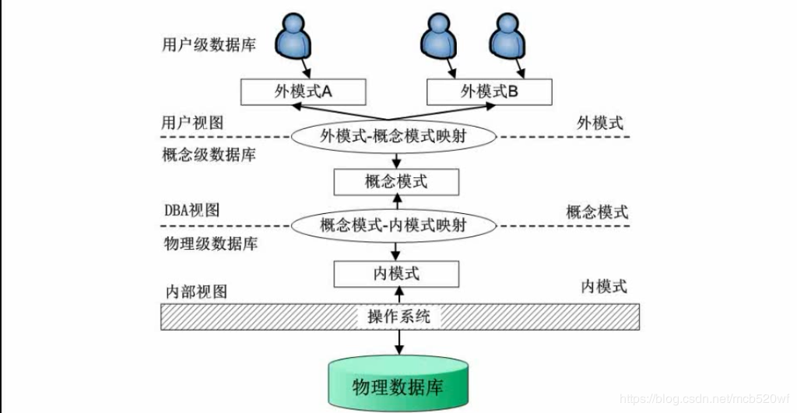

## 数据库设计

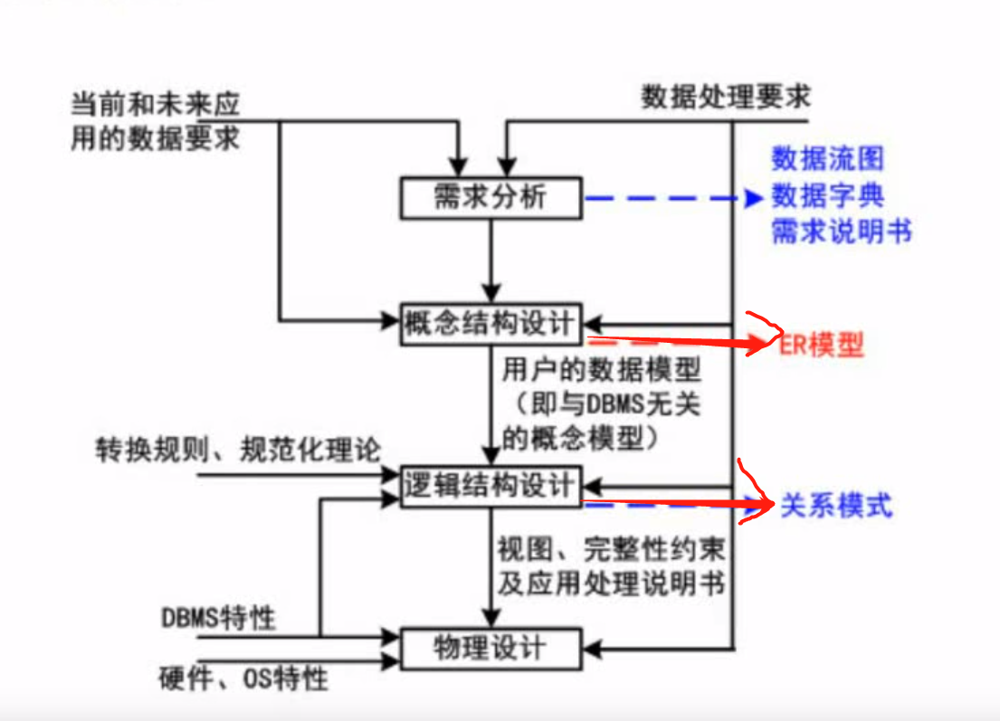

## E-R模型

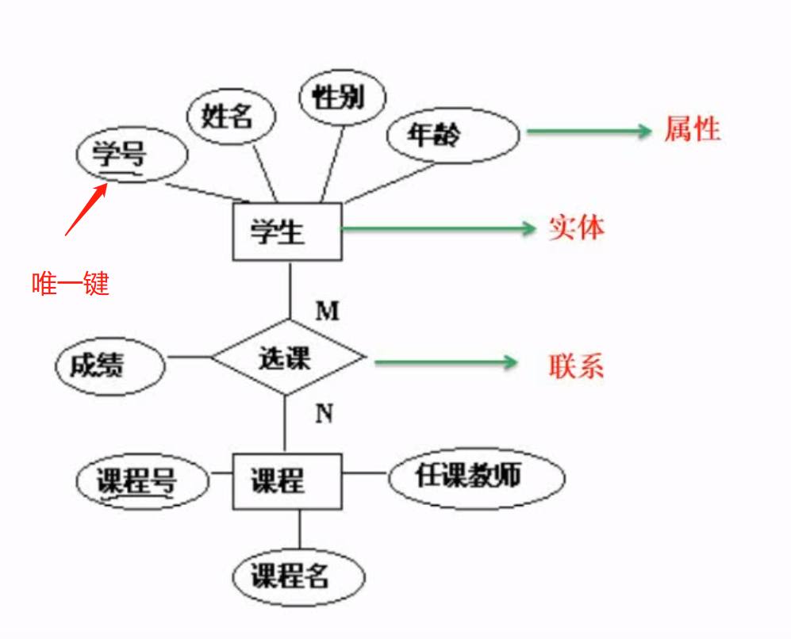

1:1联系：可把联系合并到其中任意一个表中，至少转化为2个关系模式

1:n联系：可把联系合并到n的表中，如部门-员工（1各部门对多个员工），至少转化为2个关系模式

m:n联系：需要单独把联系抽取为一个关系模式，至少转化为3个关系模式

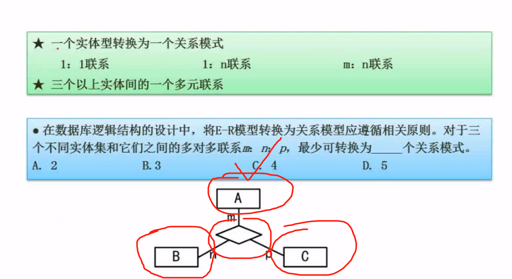

## 关系代数

`并`：S1与S2全部集合

`交`：S1与S2相同部分

`差`：S1-S2 => S1中去除S2与S1相同的部分（S1交S2）

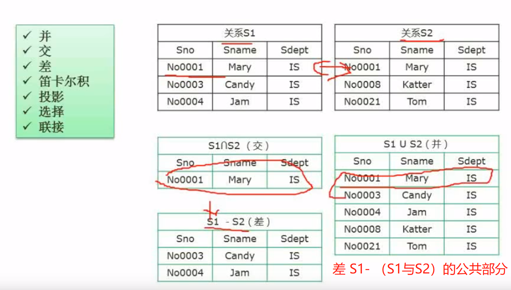

`笛卡尔积`：S1与S2笛卡尔积 => S1每一条记录与S2每一条记录组合，共有Row(S1) * Row(S2) 条记录

`投影`：选出需要的列，相当于SQL语句 select Sno, Sname from S1 中指定Sno, Sname

`选择`：选出需要的记录（行），相当于SQL语句 select * from S1 where Sno = No0003 中的where语句

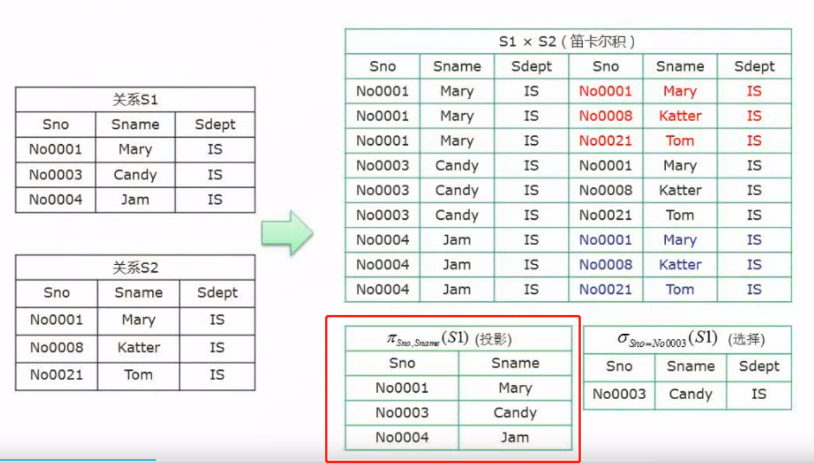

`联接`：相当于inner join on S1.xxx = S2.xxx  结果集中列只保留一项（笛卡尔积全部保留）

没有条件 = 自然联接（两个表中相同的字段）

注意笛卡尔积与联接的差异：联接操作中两个表都有的字段字段只保留一个，笛卡尔积全部保留

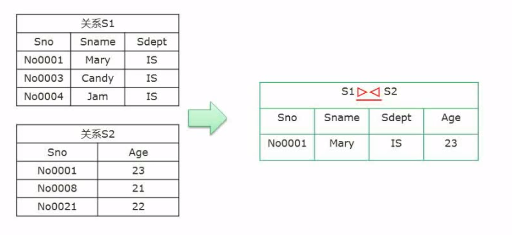

## 规范化理论

- ### 函数依赖

函数依赖：假如f(x) = y，x能确定唯一的一个y，y没法确定x，那么称为函数依赖。例如：学号 -> 姓名

部分函数依赖：主键是两个属性的组合键，主键中的一部分可以确定某一个属性。例如：(学号，课程号) -> 姓名，学号或者课程号都是部分函数依赖

传递函数依赖：A能确定B，B能确定C，则A能确定C，其中B不能确定A。例如：学号 -> 姓名 -> 性别，如果学号能确定姓名，姓名能确定性别，那么学号能直接确定性别

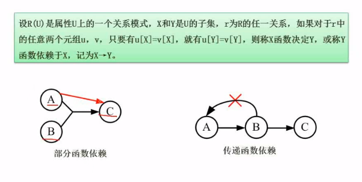

- ### 价值与用途

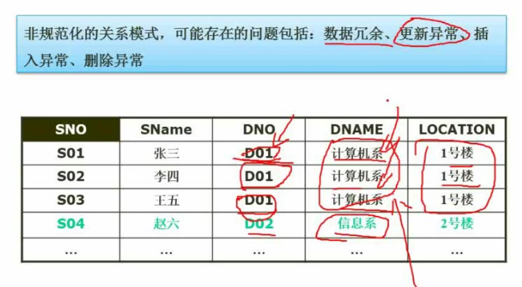

- ### 键

（学号，姓名）-> 性别

`超键`（可能存在冗余属性）：学号，姓名 唯一标识元组 学号能确定性别 学号和姓名的组合键也能确定性别

`候选键`（不存在冗余属性）：学号 超键基础上取出冗余属性，学号能确定性别就不需要姓名了，去除姓名

`主键`：在多个候选键中选择一个作为主键

`外键`：指向其他表

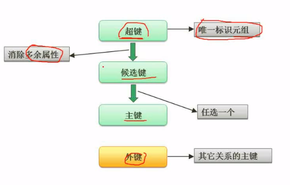

- ### 求解候选键（图示法）

1. 把关系转化为有向图
2. 找入度为0的属性，能遍历完整个图的则是候选键
3. 若找不到入读为0的属性，则找既有入度又有出度的中间结点，能遍历完全图则为候选键

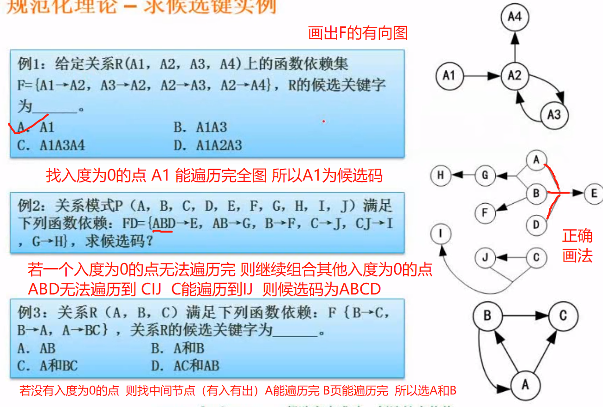

- ### 范式（必考，结合函数依赖和候选键）

[数据库设计范式参考](https://www.cnblogs.com/knowledgesea/p/3667395.html)

  逐步优化，解决：更新异常、插入异常、删除异常、数据冗余

`第一范式（1NF）`：`属性值都是不可分的原子值`。在关系模式R中，当且仅当所有域只包含原子值，即每个分量都是不可再分的数据项，则称R是第一范式。满足第一范式是关系模式规范化的最低要求。

`第二范式（2NF）`：在1NF基础上`消除非主属性对候选键的部分依赖`。当且仅当R是1NF，且每一个非主属性完全依赖主键（主键为单属性或不存在部分依赖）时，则称R是第二范式。

`第三范式（3NF）`：在2NF基础上`消除非主属性对候选键的传递依赖`。当且仅当R是1NF，且E中没有非主属性传递依赖于码时，则称R是第三范式。

`BC范式（BCNF）`：在3NF基础上，`消除主属性对候选键的传递依赖`。设R是一个关系模式，F是它的依赖集，R属于BCNF当且仅当其F中每个依赖的决定因素必定包含R的某个候选码（所有依赖的决定因素都是候选键）。

`主属性`：候选键的一部分

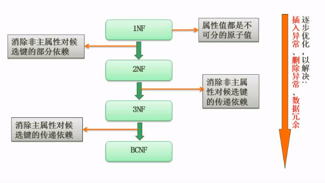

`例题`：

1. 不属于第三范式有两种情况: 未达到第二范式（存在部分函数依赖）或者 达到第二范式不符合第三范式（存在传递函数依赖）；题中部门表中的部门号能确定所有属性，不需要组合候选码，已经消除了非主属性对候选键的部分依赖，因此达到了第二范式，因而只能选C

2. 需要得到表4的结构需要添加职工号-部门号之间的联系，部门和职工属于1:n关系，应把联系保存在n的一端，即在职工表中添加部门号，选D

3. 通过观察表4，在问题2中已经建立了职工号和部门号之间的关联，不需要再加部门号，排除C、D；有商品号可确定商品名称，属于冗余信息，排除B，因此选A

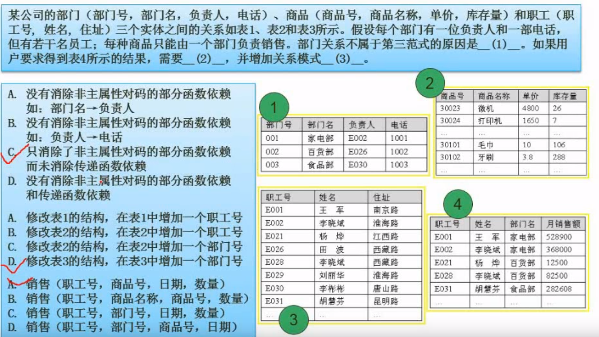

- ### 模式分解

`保持函数依赖分解`：假设关系模式R(A,B,C)存在A->B，B->C，那么将R分解为R1(A,B)，R2(B,C)，R1保持了A->B函数依赖，R2保持了B->C函数依赖，为保持函数依赖分解；而将R分解为R1(A,B)，R3(A,C)没有保持B->C函数依赖

`无损分解`：分解后的关系模式可以还原为原关系模式

1. 列表法

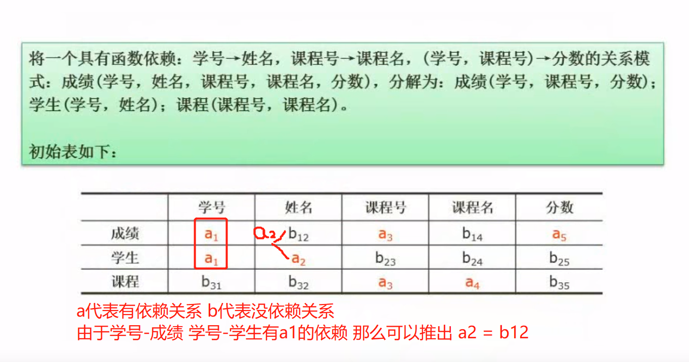

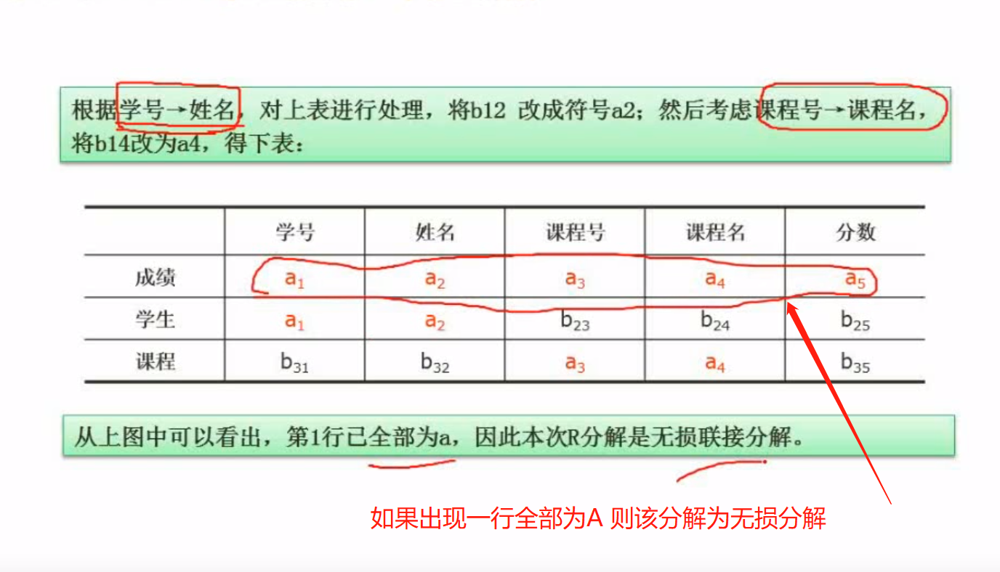

2. 代表法（只适用于一分为二的情况）

假设将关系模式R分解为R1和R2，得到R1与R2的交集A，R1-R2的差B1，R2-R1的差B2，如果存在A->B1 或者A->B2，则为无损分解，否则为有损分解

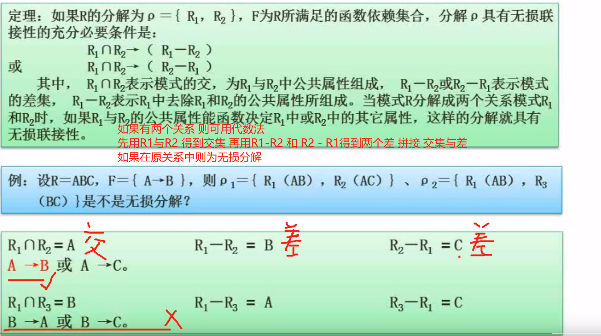

## 并发控制

- ### 事务

`原子性`：整个事务中的所有操作，要么全部完成，要么全部不完成，不可能停滞在中间某个环节。事务在执行过程中发生错误，会被回滚（Rollback）到事务开始前的状态，就像这个事务从来没有执行过一样。

`一致性`：在事务开始之前和事务结束以后，数据库的完整性约束没有被破坏。

`隔离性`：隔离状态执行事务，使它们好像是系统在给定时间内执行的唯一操作。如果有两个事务，运行在相同的时间内，执行相同的功能，事务的隔离性将确保每一事务在系统中认为只有该事务在使用系统。这种属性有时称为串行化，为了防止事务操作间的混淆，必须串行化或序列化请求，使得在同一时间仅有一个请求用于同一数据。

`持久性`：在事务完成以后，该事务所对数据库所作的更改便持久的保存在数据库之中，并不会被回滚。

`并发处理`：提高操作的效率

- ### 并发控制存在的问题

  - 丢失更新

  - 不可重复读

  - 读“脏”数据（临时值）

- ### 封锁协议

  - `X锁`：排它锁 也称为写锁

  - `S锁`：共享锁 也称为读锁

[数据库中的锁机制和封锁协议](https://blog.csdn.net/u011244839/article/details/74454933)

- #### 一级封锁协议 可防止丢失修改

`一级封锁协议`是指，事务T在修改数据R之前必须先对其加X锁，`直到事务结束才释放`。一级封锁协议可以防止丢失修改，并保证事务T是可恢复的。

即更新数据前先加写锁

- #### 二级封锁协议 可防止丢失修改，还可防止读“脏”数据

`二级封锁协议`是指，在一级封锁协议基础上增加事务T在读数据R之前必须先对其加S锁，`读完后即可释放S锁`。二级封锁协议除防止丢失修改，还可以进一步防止读“脏”数据。

即在一级封锁协议的基础上，读数据先加读锁，读完立即释放读锁

- #### 三级封锁协议 可防止丢失修改、读“脏”数据与数据不可重复读

`三级封锁协议`是指，在一级封锁协议基础上增加事务T在读数据R之前必须先对其加S锁，`直到事务结束才释放`。三级封锁协议除防止了丢失修改和读“脏”数据外，还可以进一步防止不可重复读。

即在一级封锁协议的基础上. 读数据先加读锁，等事务结束再释放读锁（与二级封锁协议释放时间点不同）

- #### 两段锁协议 可串行化，有可能发生死锁

`两段锁协议`：是指所有的事务必须分两个阶段对数据项加锁和解锁。即事务分两个阶段，第一个阶段是获得封锁。事务可以获得任何数据项上的任何类型的锁，但是不能释放；第二阶段是释放封锁，事务可以释放任何数据项上的任何类型的锁，但不能申请。

## 数据库完整性约束

`实体完整性约束`: 体现在主键不能为空、不能重复等，必须按照主键的要求输入

`参照完整性约束`: 体现在外键设置上，按照外键的约束输入

`用户自定义完整性约束`: 体现在用户自定义约束上，比如男设置为1、女设置为0等

`触发器`：实现更高级别的要求

## 数据库安全

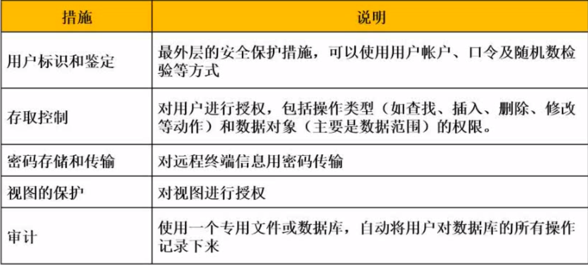

## 数据备份
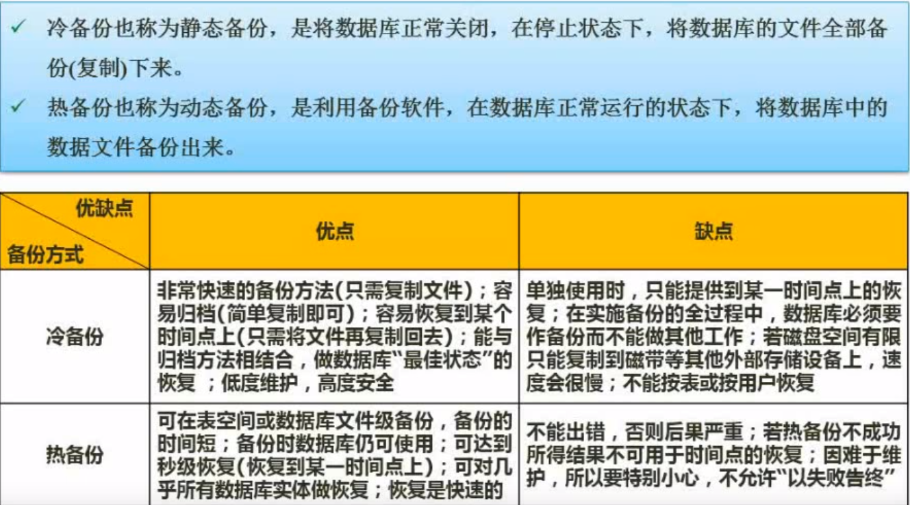

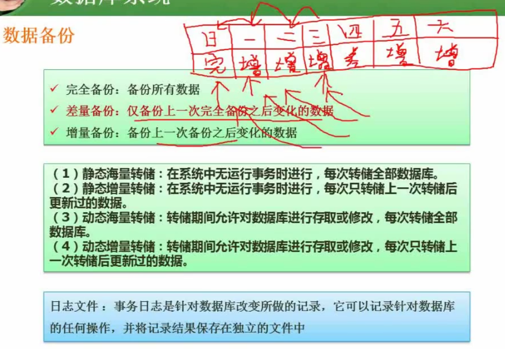

## 数据库故障与恢复
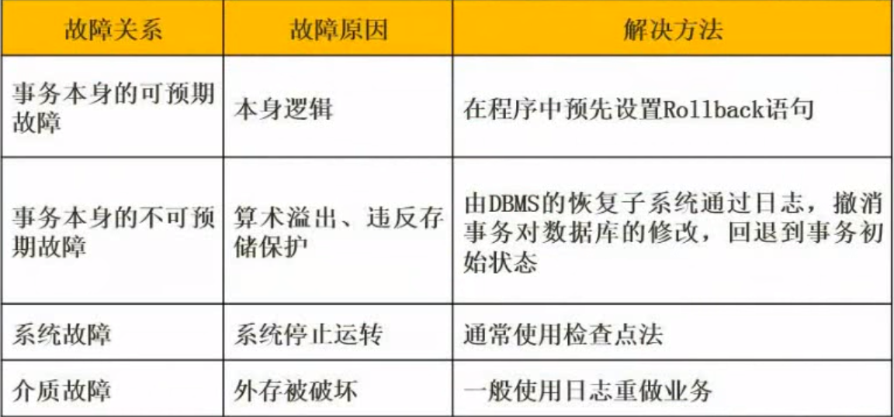

## 数据仓库与数据挖掘

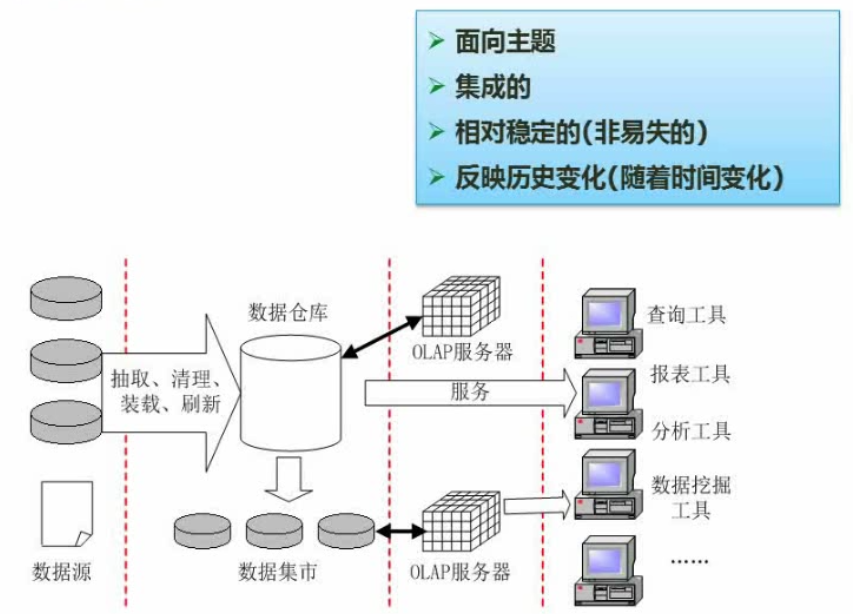

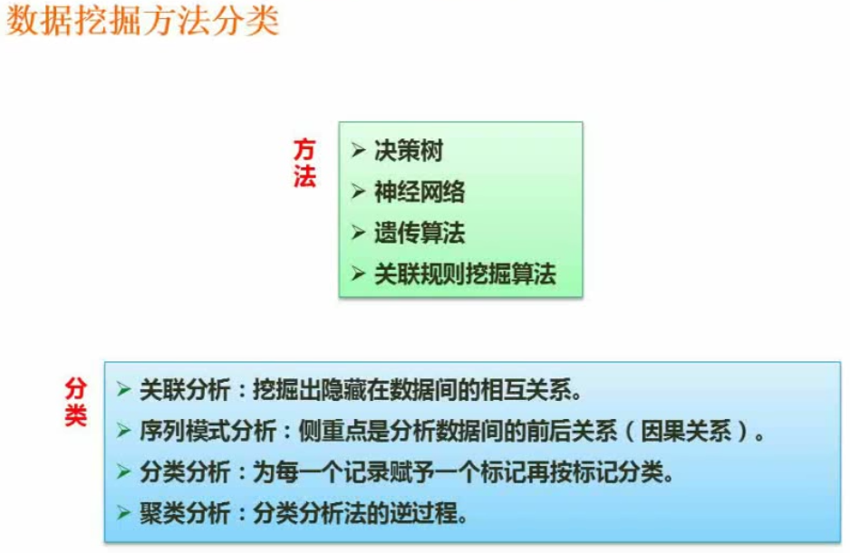

## 反规范化（规范化的逆过程）

## 大数据基本概念

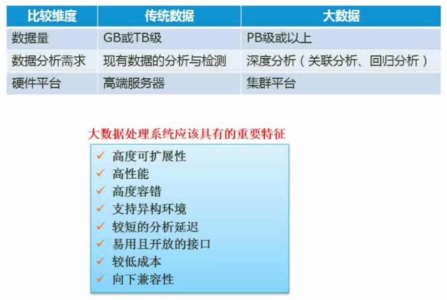