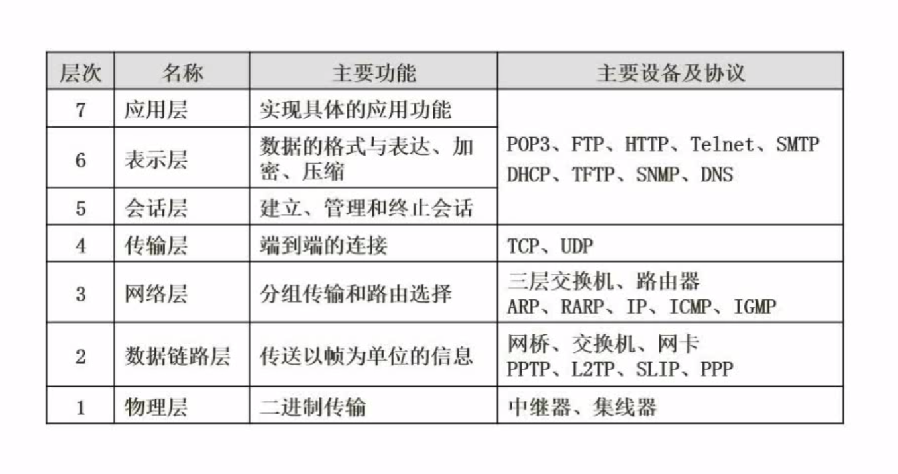
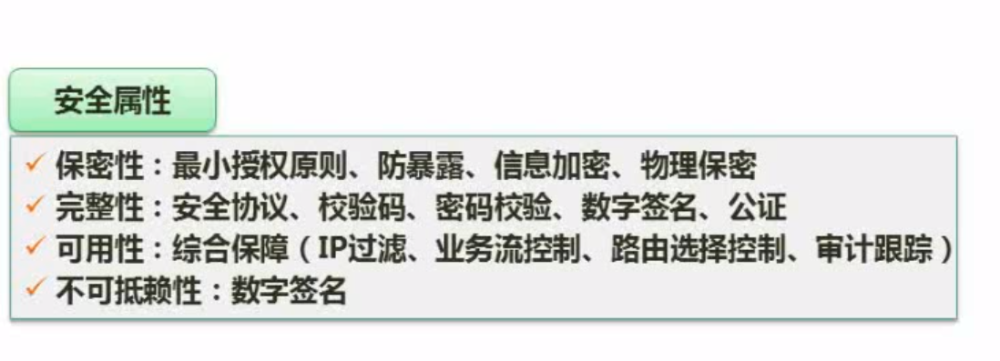
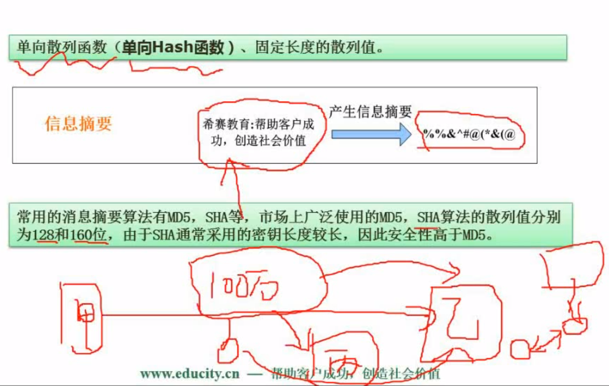
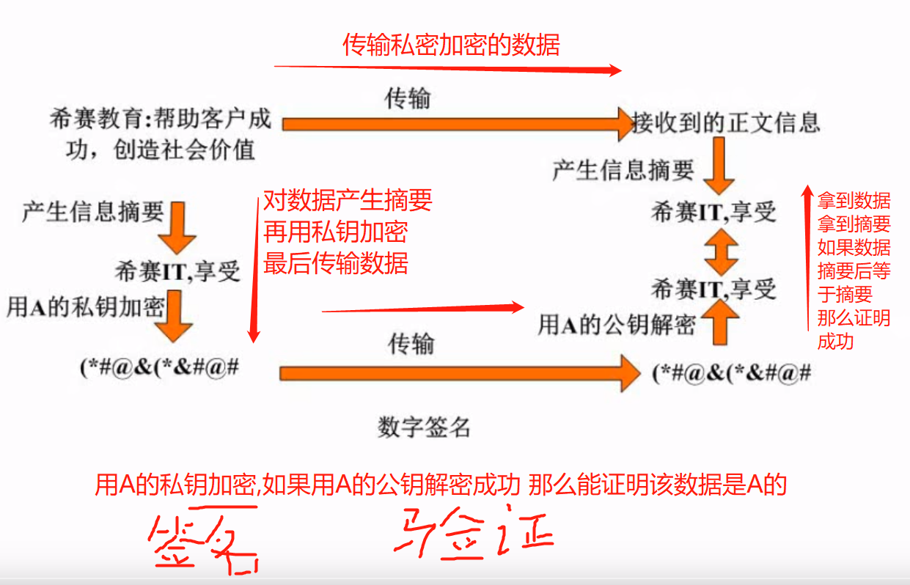
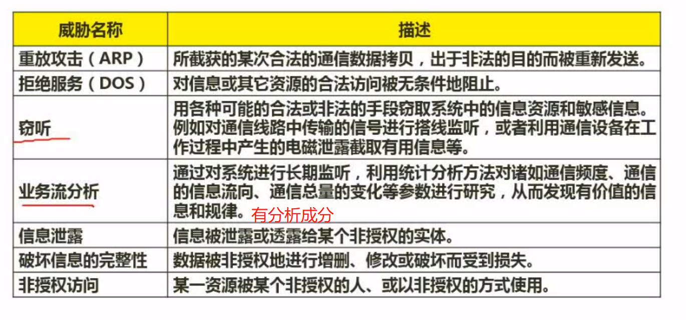
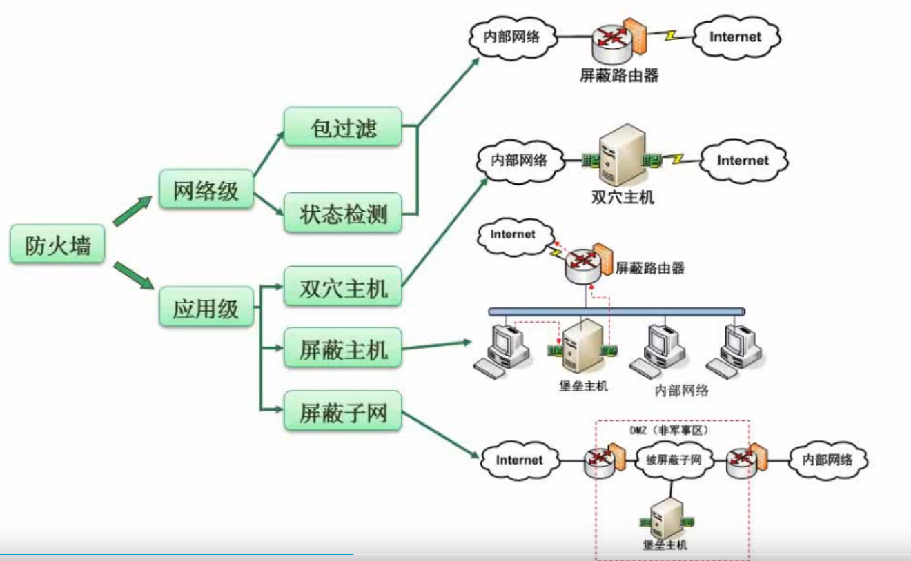

# 计算机网络基础

## OSI/RM七层模型


`例题`


## 网络技术标准与协议

### TCP/IP协议：Internet，可扩展，可靠，应用最广，牺牲效率和速度


- 网络层：

  `ICMP`：Internet控制报文协议，ping命令

  `ARP`：地址解析协议，将IP地址转换为Mac地址

  `RARP`：反地址解析协议，将Mac地址转换为IP地址

- 网络层：

  TCP可靠，有验证机制，存在反馈信息；UDP不可靠

- 应用层：

  * 以TCP为基础的应用协议

    `POP3，STTP`：邮件传输协议

    `FTP`：件传输协议

    `HTTP`：超文本传输协议

    `Telnet`：远程传输协议

  * 以UDP为基础的应用协议

    `DHCP`：动态主机配置协议

    `TFTP`：小文件传输协议

    `DNS`：域名解析协议

`DHCP协议`


`DNS协议`


 `DNS协议例题`

 

 ## 计算机网络结构的分类

 ### 拓扑结构

 

 ## 网络规划与设计

 

`逻辑网络设计`

 

`物理网络设计`

 

`分层设计`

核心层通常有冗余设计，避免故障

 

## IP地址与子网划分

### IP地址


### 子网划分

`子网掩码`：区分一个IP地址哪些部分（为1）是网络位，哪些部分（为0）是主机位


`例1`：

将B类IP地址168.195.0.0划给为27个子网，子网掩码为多少？

将168.195.0.0转化为二进制：1010 1000 1100 0011 0000 0000 0000 0000；

因为是B类地址，默认前16位为网络位，后16位为主机位，划给子网需要使用到主机号，2<sup>n</sup> >= 27 n = 5，需要多用到5个主机位；

得到子网掩码为：1111 1111 1111 1111 1111 1000 0000 0000，转化为二进制为：255.255.248.0

`例2`：

将B类IP地址168.195.0.0划分若干个子网，每个子网内有主机700台，子网掩码为多少？

因为每个子网内有700台主机，需要占用主机位：2<sup>k</sup> - 2 >= 700 k = 10位；

得到子网掩码为：1111 1111 1111 1111 1111 1100 0000 0000，转化为二进制为：255.255.252.0

### 无分类编址（无类域间路由）


### 特殊含义的IP地址（选择题）


### HTML


## 接入技术

### 无线网


### 网络接入技术


## IPv6


### 信息系统安全属性


### 加密技术

```
对称加密技术：可用原加密的密钥解密 DES 3DES AES RC-5 IDEA
非对称加密技术: 公钥加密需要私钥解密 私钥加密需要公钥解密 RSA ECC等
```

- 对称加密技术


- 非对称加密技术


### 信息摘要
```
只能单向散列, 摘要后无法复原原文 如MD5,SHA
```


### 数字签名


### 数字证书与CA


### 设计邮件加密系统


```
A的邮件内容(500MB)通过对称加密(速度快)得到对称密钥K, 并把加密后的邮件(邮件密文)发送给B
A将邮件内容进行信息摘要(提取特征信息,防止拦截伪装) 用B的公钥加密发送给B
A将对称密钥K 用自己的私钥加密(进行数字签名) 用B的公钥加密发送给B

B收到邮件密文(对称加密),摘要密文(A的私钥加密),对称密钥密文(B的公钥加密)
B将对称密钥密文通过自己的公钥解密 得到对称密钥K
B将对称密钥K解密邮件密文 得到邮件内容
B将邮件内容进行摘要 得到摘要, 通过自己的私钥解密摘要密文得到摘要 判断两个摘要是否相等可得到结果
```
### 网络安全






