# 系统安全分析与设计

## 信息系统安全属性

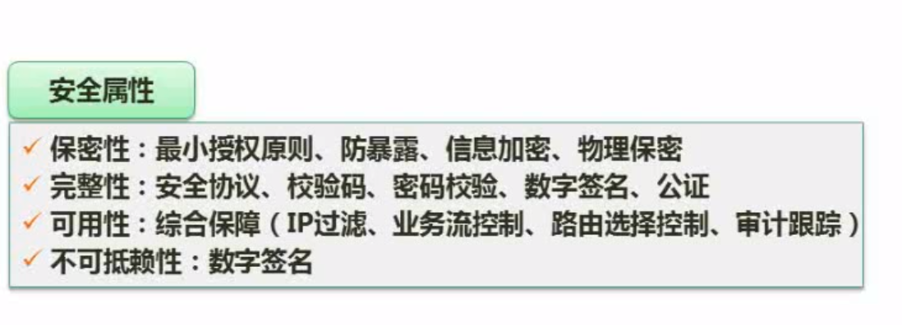

## 加密技术

`对称加密技术`：可用原加密的密钥解密，特点：速度快，效率高，加密强度低，秘钥分发困难；常见算法：DES，3DES，AES，RC-5，IDEA

`非对称加密技术`：公钥加密需要私钥解密，私钥加密需要公钥解密，公私钥一一对应，通常使用非对称加密技术传输对称加密技术的秘钥，特点：速度慢；常见算法：RSA，ECC等

### 对称加密技术

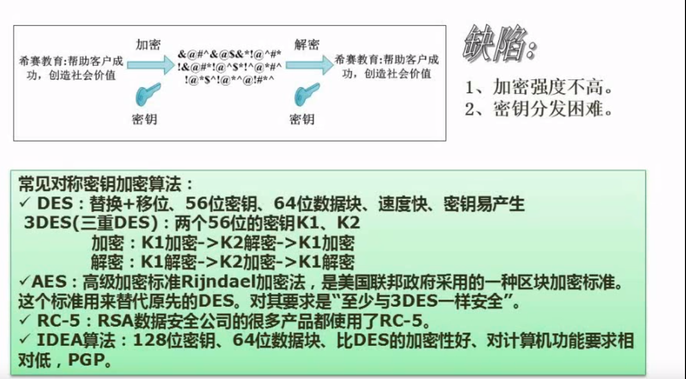

### 非对称加密技术

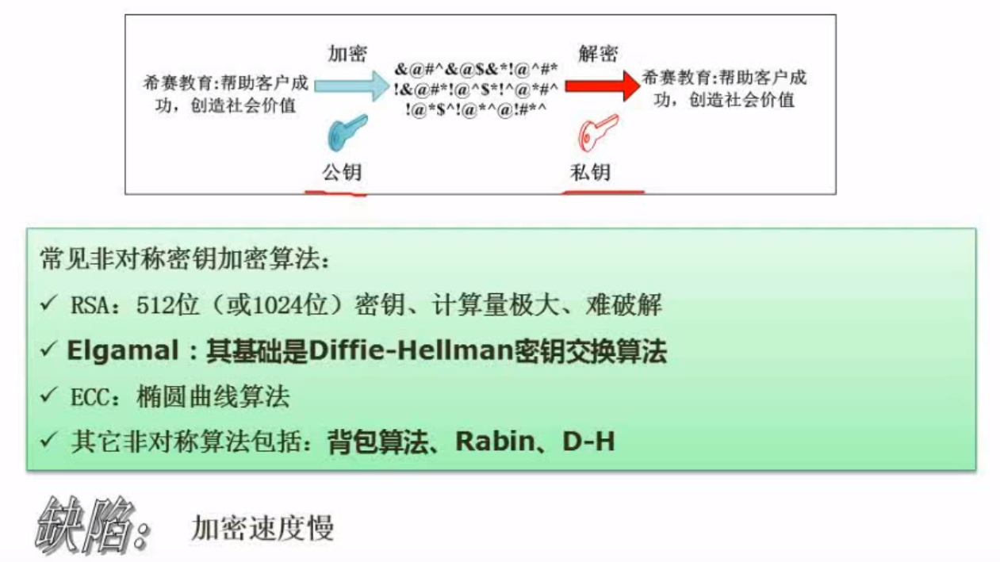

## 信息摘要

只能单向散列（Hash），摘要后无法复原原文，常用于完整性校验，不能用于加密，常用算法：MD5，SHA

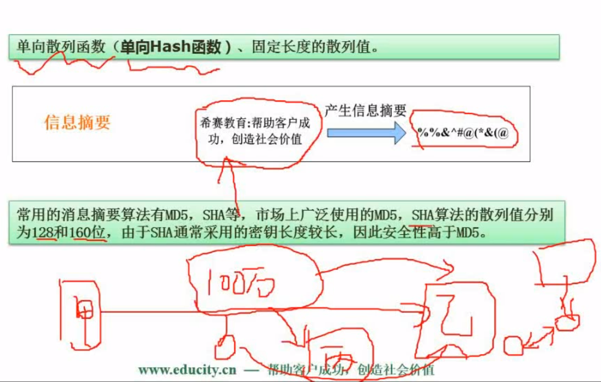

## 数字签名

具有身份识别功能，而非加密

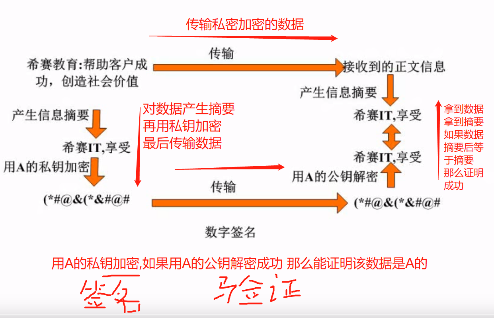

## 数字信封与PGP

[一句话总结数字签名、数字证书、数字信封](https://blog.51cto.com/liu008qing/2427211)

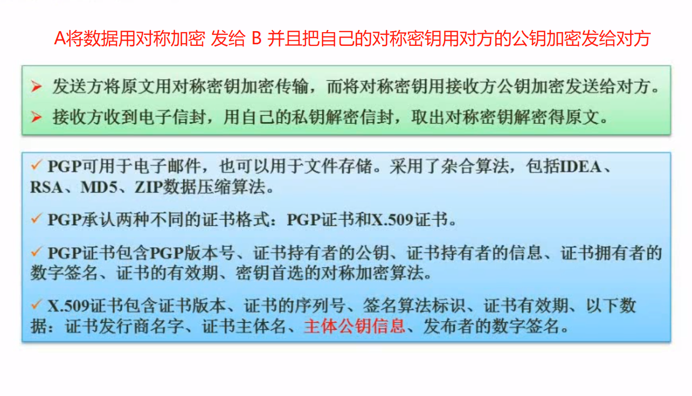

## 练习题：设计邮件加密系统

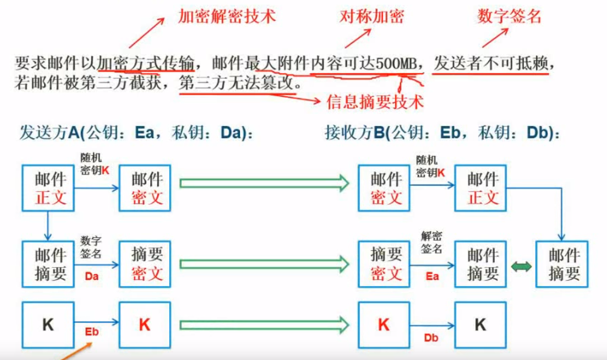

A的邮件内容（500MB）通过对称密钥K加密（速度快）得到加密后的邮件（邮件密文）并发送给B

A将邮件内容提取信息摘要（Hash提取特征信息，完整性校验，防止第三方篡改）后再用A的私钥加密（数字签名，身份验证，不可抵赖）得到摘要秘文，发送给B

A将对称密钥K，用B的公钥加密得到对称密钥密文后发送给B

B收到邮件密文（对称加密），摘要密文（A的私钥加密），对称密钥密文（B的公钥加密）

B将对称密钥密文通过自己的私钥解密，得到对称密钥K

B使用对称密钥K解密邮件密文，得到邮件内容

B将解密后得到的邮件内容进行摘要，得到一个摘要明文，通过A的公钥解密接收到的摘要密文得到另一个摘要明文，判断两个摘要是否一致即可确认该邮件内容是否为A发送（数字签名），有没有经过他人篡改（信息摘要）

## 网络安全

### 各个网络层次的安全保障

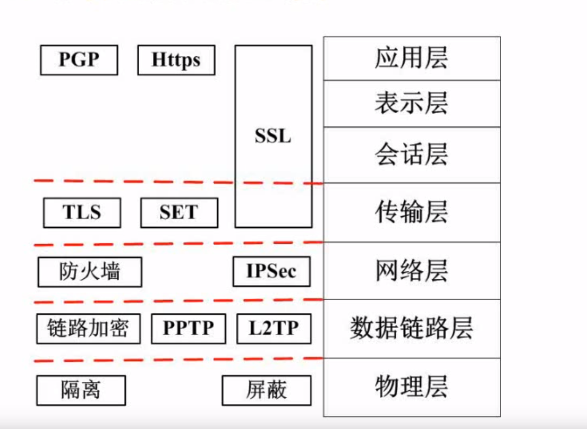

### 网络威胁与攻击

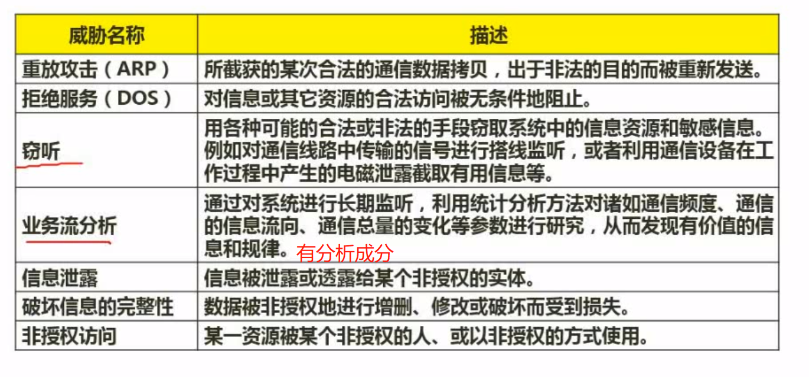

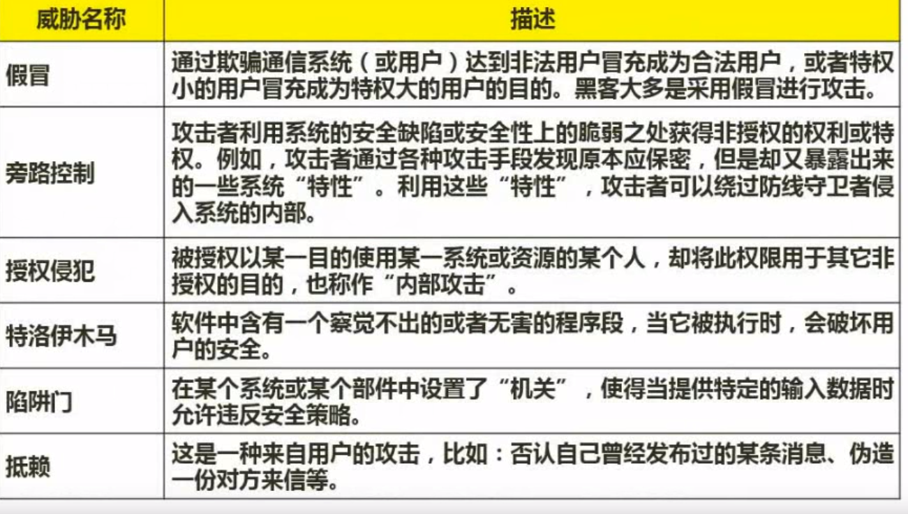

### 防火墙

网络层级别低，应用层效率低

应用级主要掌握屏蔽子网

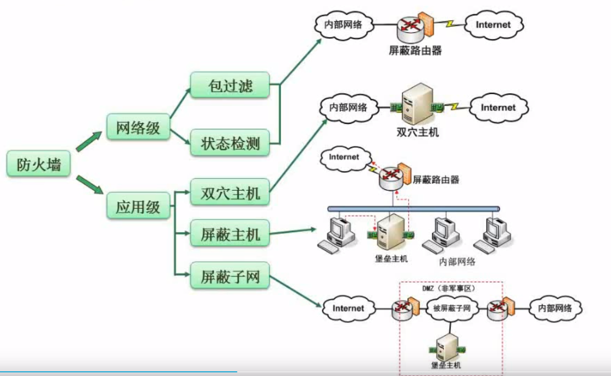
