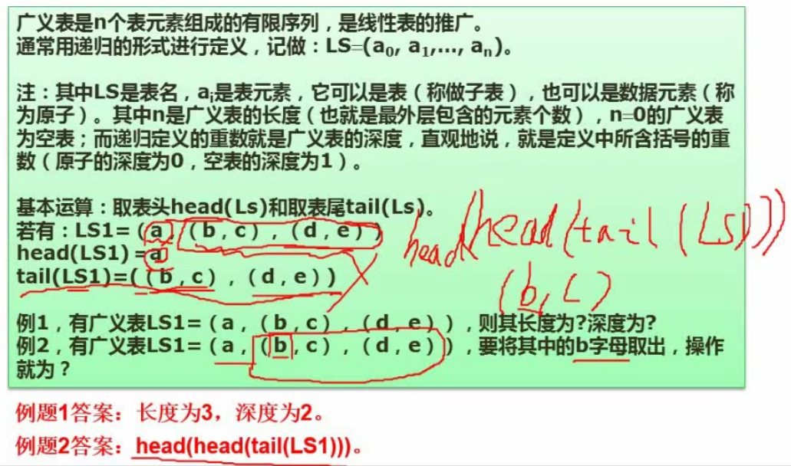

# 数据结构与算法基础（非常重要）

- 数组与矩阵
- 线性表（必考）
- 广义表
- 树与二叉树（必考）
- 图
- 排序与查找（重要）
- 算法基础及常见的算法

## 数组与矩阵

### 数组

### 稀疏矩阵

解题技巧：代入法（A0,0, A1,1）

## 数据结构的定义

## 线性表（必考）

- ### 线性表常见存储结构

- ### 链表的基本操作

- ### 顺序存储与链式存储比较

- ### 队列与栈（重要，必考）

  避免对满条件与对空条件一致：少存一个

## 广义表

  长度：最外层的表包含的元素个数

  深度：嵌套的次数，包含括号的层数

  表头：第一个表元素，head()操作

  表尾：除第一个元素外的其他所有元素，tail()操作

## 数与二叉树（必考）

  结点的度：拥有的孩子结点数

  树的度：所有结点的度的最大值

  叶子结点：没有孩子结点的结点

  分支结点

  内部结点：非叶子结点，也非根结点

  父结点、子结点：相对概念

  兄弟结点：平级结点，不一定属于同一个父结点

  层次

- ### 二叉树的分类及重要特性

完全二叉树：除了最下层，其余是完整的；且最下一层从左到右依次排列，只缺最右边的

- ### 二叉树的遍历

  - #### 层次遍历：从顶层开始，从左到右 1 2 3 4 5 6 7 8
  
  - #### 前序遍历：根结点->左子结点->右子结点 1 2 4 5 7 8 3 6

  - #### 中序遍历：左子结点->根结点->右子结点 4 2 7 8 5 1 3 6

  - #### 后序遍历：左子结点->右子结点->根结点 4 8 7 5 2 6 3 1

- ### 反向构造二叉树

- ### 树转二叉树

孩子结点->左子树结点

兄弟节点->右孩子结点

简化->连线法：连接兄弟结点，孩子结点只保留第一个，变形

- ### 查找二叉树（排序二叉树）

左孩子的值小于根，右孩子的值大于根

- ### 最优二叉树（哈夫曼树）

  基本概念：

  - 树的路径长度：从树根到树中每一结点的路径长度之和

  - 权：叶子结点的数据信息

  - 带权路径长度：结点与根之间的路径长度与该结点上权的乘积

  - 树的带权路径长度（树的代价）：树中所有叶子结点的带权路径长度的和

  - 哈夫曼树：树的带权路径长度（树的代价）最小

  构造哈夫曼树：依次找权值最小的两个

- ### 线索二叉树（方便遍历）

  在二叉树基础上增加前驱和后继信息，按前序、中序、后序遍历分为前序线索二叉树、中序线索二叉树、后序线索二叉树
  

- ### 平衡二叉树（提高排序二叉树的查找效率）

  任意节点的左右子树深度相差不超过1

  每结点的平衡度（=左子树深度-右子树深度）只能为-1、0、1

## 图

### 基本概念

### 邻接矩阵

### 邻接表

### 图的遍历

  - #### 深度优先遍历
  
  - #### 广度优先遍历

### 拓扑排序（选择题）

### 图的最小生成树

  - 图和树的最大区别：树没有环路

  - 树的结点数/边数 = n/n-1

  - #### 普里姆算法

从一节点开始，选择距离最短的结点（不能选会构成环路的节点）

  - #### 克鲁斯卡尔算法

选择不构成环路的最小边

## 算法基础

### 算法的特性

- 有穷性：执行有穷步之后结束

- 确定性：算法中的每一条指令都必须有确切的含义，不能含糊不清

- 输入：>= 0

- 输出：>= 1

- 有效性：算法的每个步骤都能有效执行并能得到正确的结果。例如除数为0违反有效性

### 算法的复杂度

时间复杂度（必考，多在下午）

## 查找算法

  - ### 顺序查找（时间复杂度O(n)）

  - ### 二分查找（有序排列才能用，小数取整，时间复杂度O(log2n)）

  - ### 散列表

散列冲突的解决：线性探测法、伪随机数法

## 排序算法（必考）

  - ### 直接插入排序（数据越多，效率越低）

  - ### 希尔（Shell）排序（减少比较次数）

  - ### 直接选择排序

  - ### 堆排序（最复杂，效率比直接选择高，更适用于部分排序，如求前三名）

初建堆：按完全二叉树排列，从最后一个非叶子结点开始进行多次调整

堆重建：取出堆顶元素，将最后一个结点作为新堆顶再次进行多次调整

  - ### 冒泡排序

  - ### 快速排序（递归）

  - ### 归并（合并）排序

  - ### 基数排序

  ### 排序算法的时间复杂度、空间复杂度及稳定性（常考）

