# 程序设计语言与语言处理程序基础（难度较高）

- 编译与解释
- 文法
- 正规式（需要掌握，几乎都有）
- 有限自动机
- 表达式（需要掌握，偶尔考）
- 传值与传址（需要掌握，出现概率高）
- 多种程序语言特点

## 编译过程

解释型：例如一行代码回车后立即解释

编译型：主动编译运行

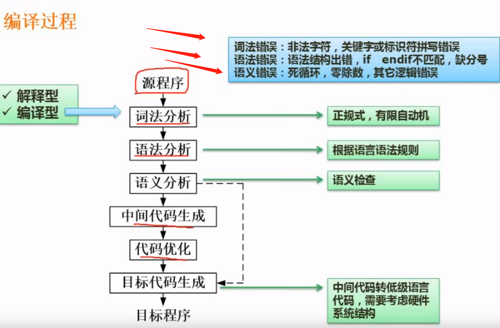

## 文法

### 文法定义

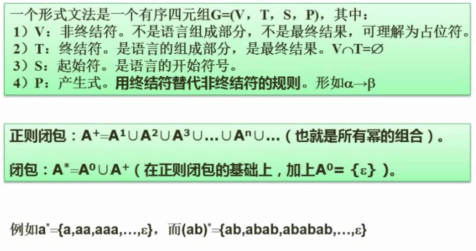

### 文法分类

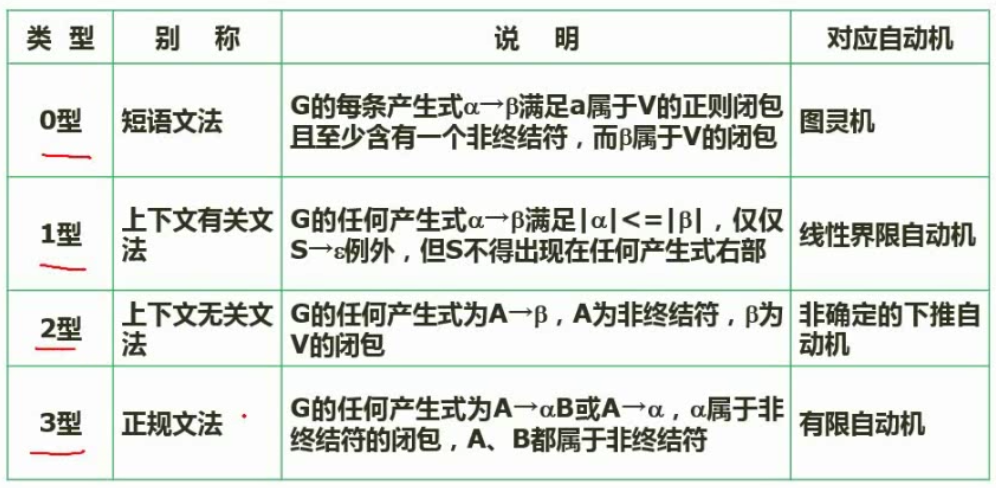

### 语法推导树

下图中：S能推导出aAS与a；A又能推导出SbA，SS，ba

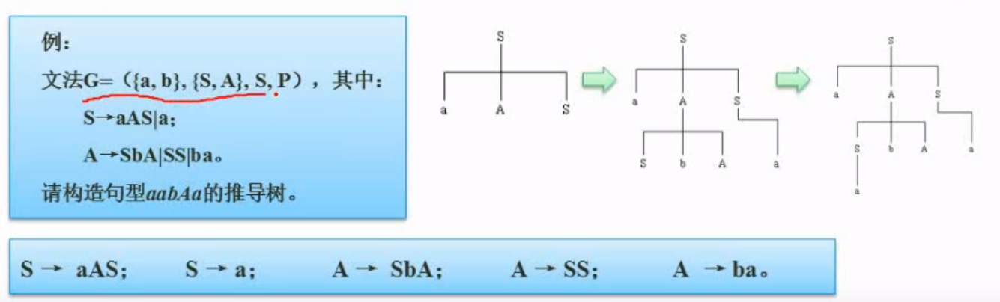

## 有限自动机（形象地表达状态转换）

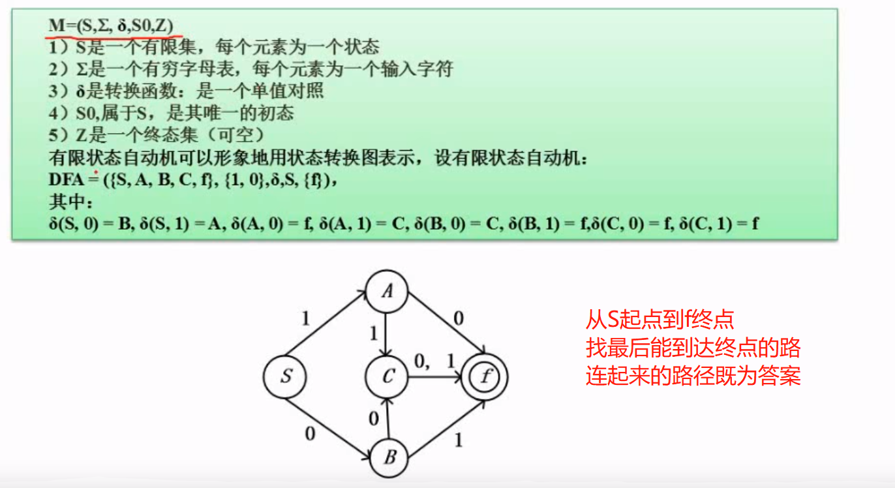

`例题`：

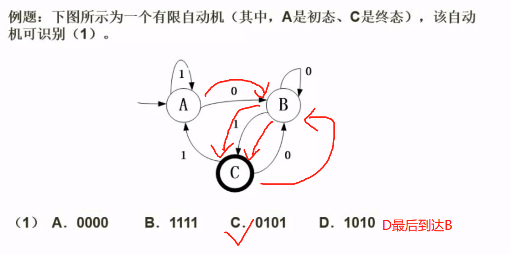

## 正规式（对有限自动机的另外一种表达形式）

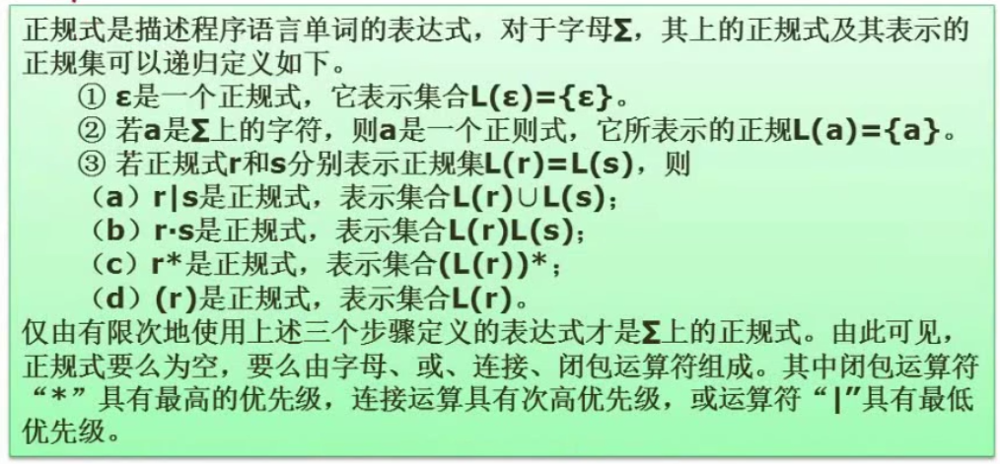

## 文法推导与正规式例题

代入法

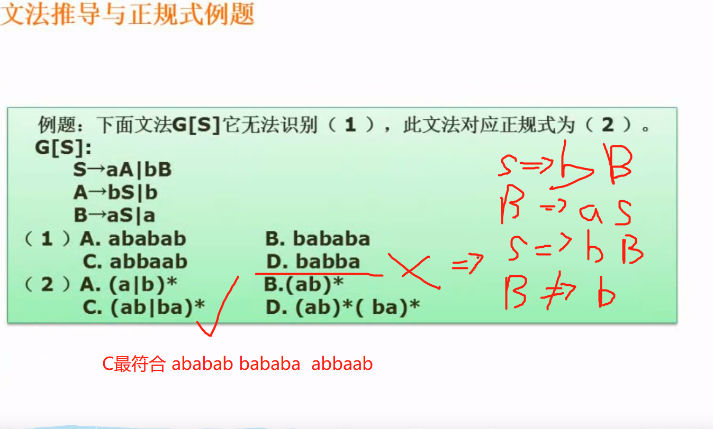

## 表达式

利用树的（前序、后序）遍历来求前缀表达式和后缀表达式

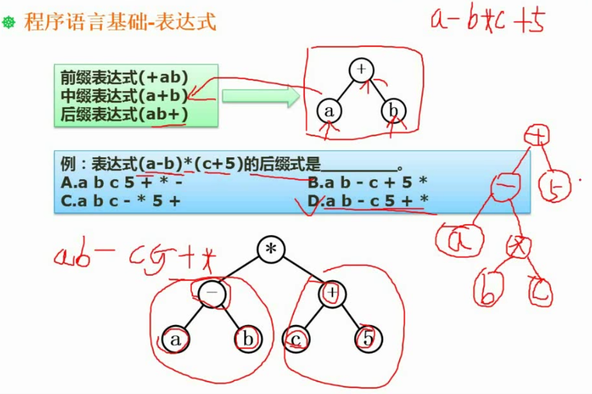

## 函数调用-传值与传址

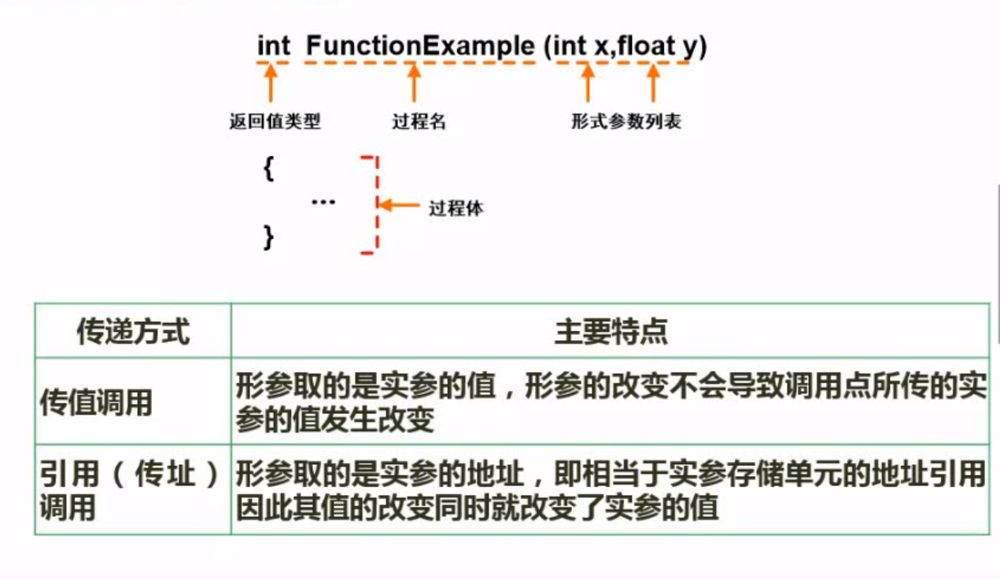

## 各种程序语言的特点

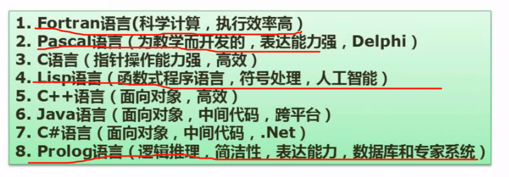
