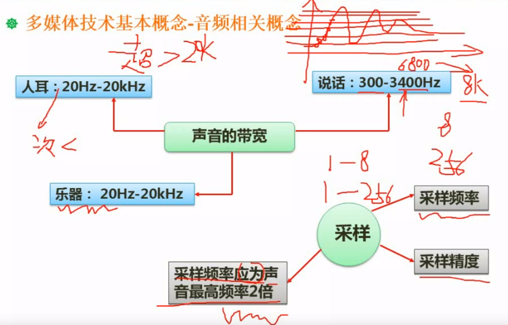
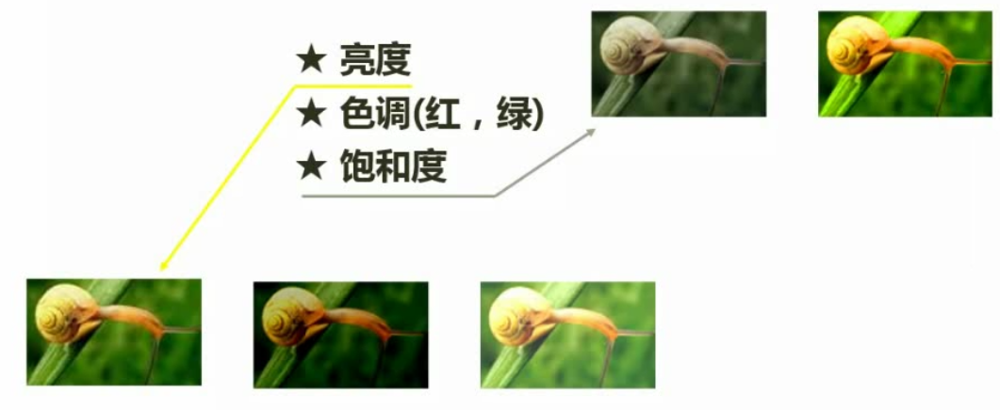
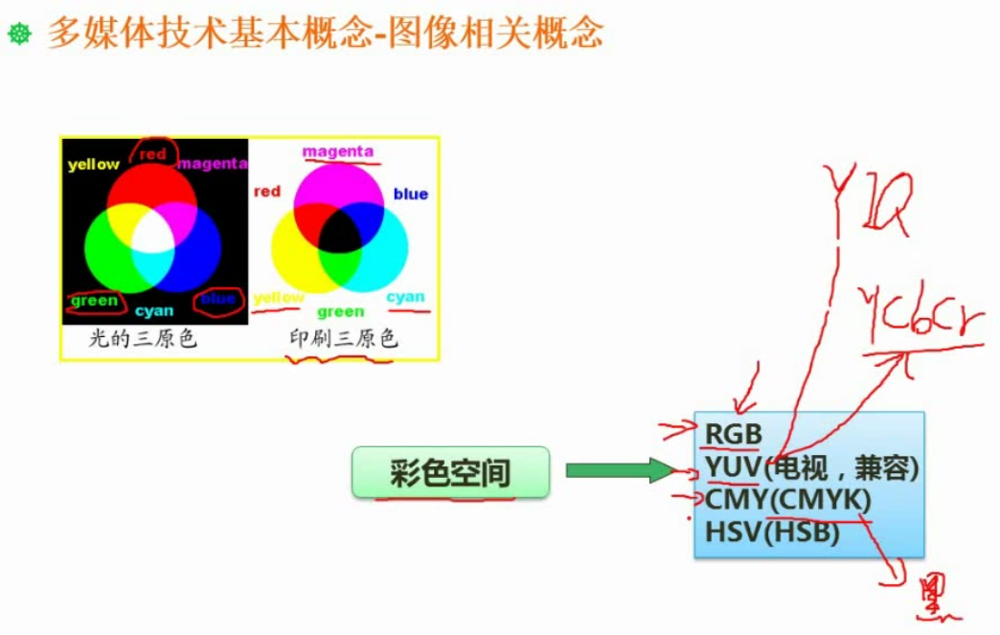
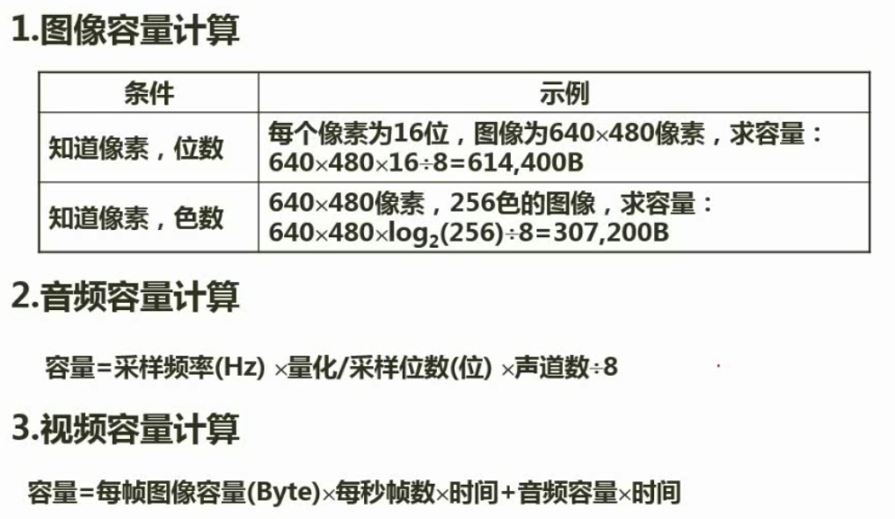
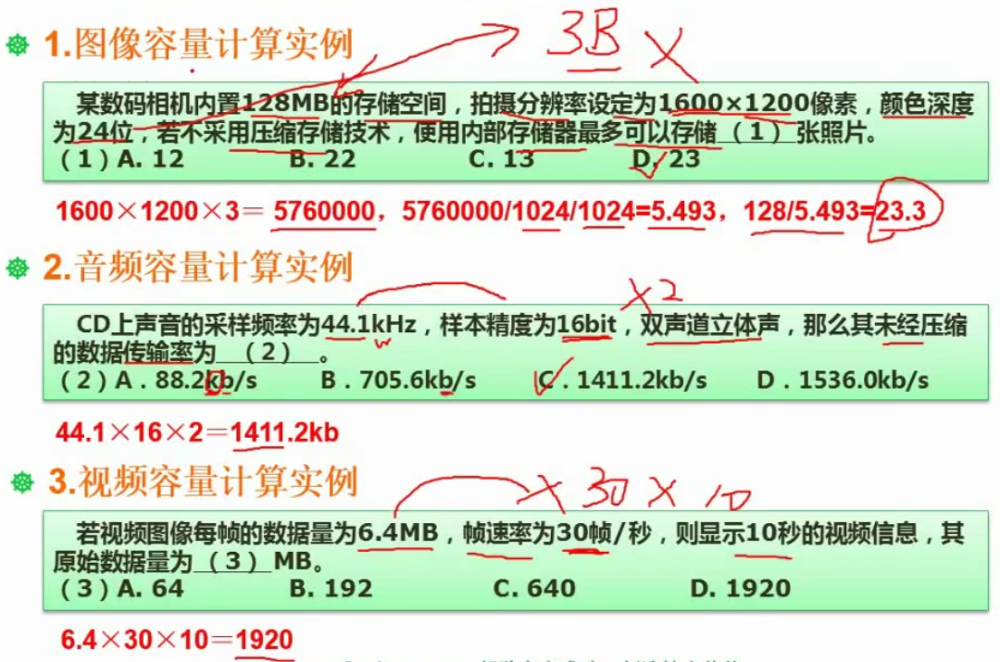
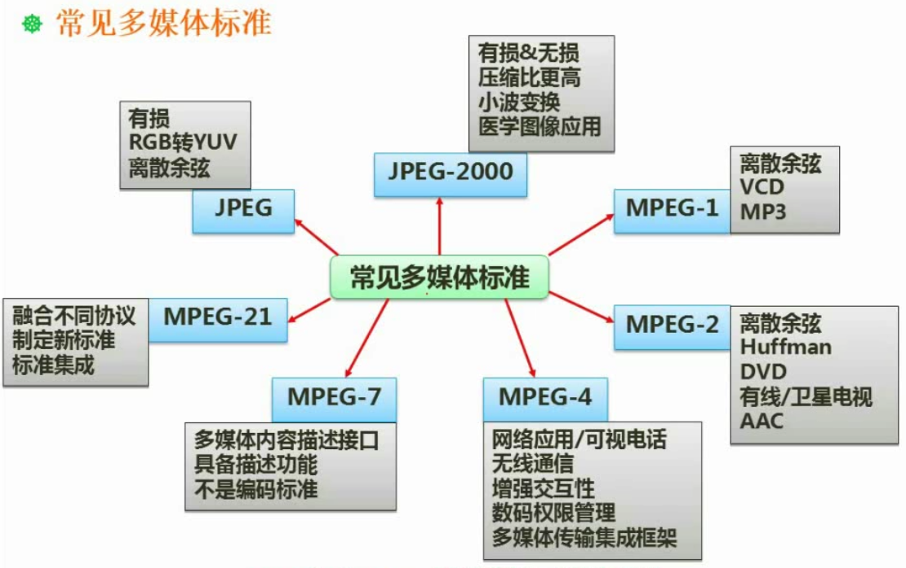
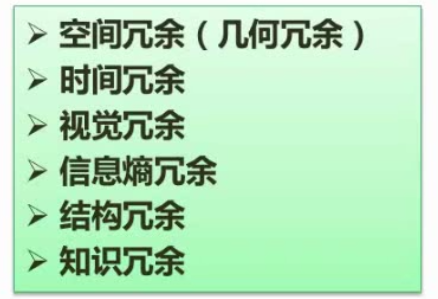
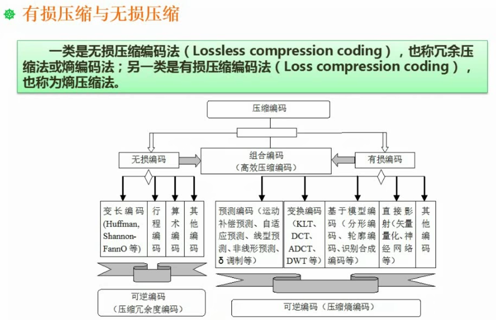

# 多媒体基础（1-3分）

- 多媒体技术相关概念
- 多媒体相关计算问题
- 常见多媒体标准
- 数据压缩技术

## 音频相关概念

采样频率一般应为声音最高频率的2倍，录制说话声音（300-3400Hz）需要8KHz，录制乐器声音（20Hz-20kHz）使用44kHz

## 图像相关概念

### 亮度、色调、饱和度

### 彩色空间

## 多媒体相关计算问题

## 常见多媒体标准

mp3：MPEG-1 layer3

## 数据压缩技术基础

有冗余才能压缩

### 有损压缩（高压缩比，熵压缩法）和无损压缩（熵编码法）

